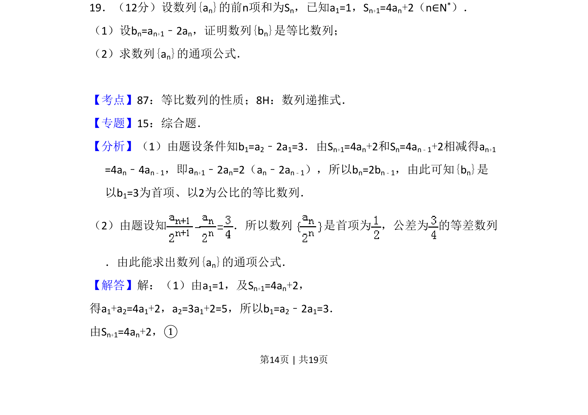
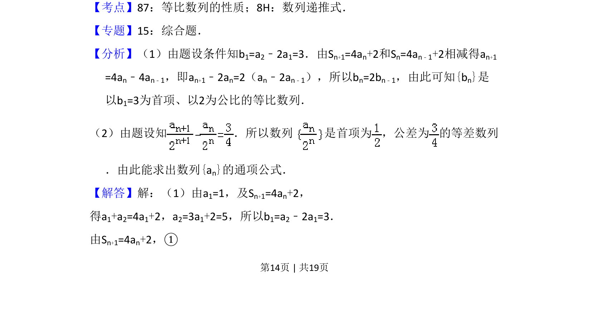
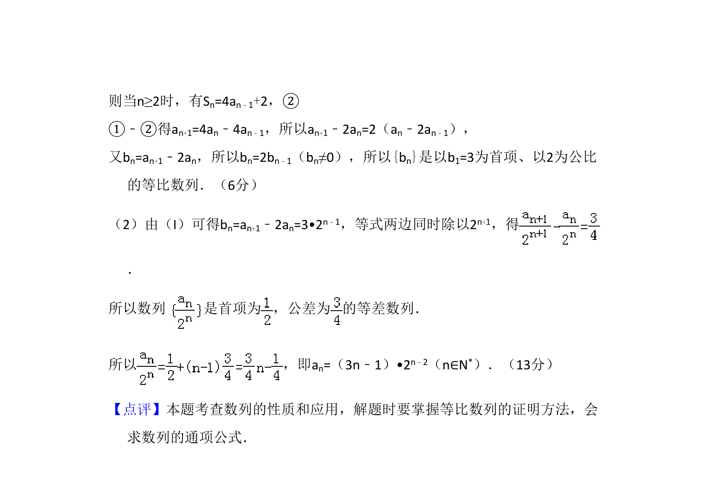

## 题面

## 摘要

本题给出数列前n项和与项的关系，通过递推式证明数列为等比数列并求通项

## 关联考点

- [[413-等比数列性质|等比数列的性质]]
- [[894-数列递推式|数列递推式]]

## 答案与解析

> 📄 原 PDF 第 14 页：`素材/真题/吉林/2008-2024·（吉林）数学高考真题/2009年高考数学试卷（理）（全国卷Ⅱ）（解析卷）.pdf`

<!-- 题干文本-start -->
## 题干文本
19．（12分）设数列{an}的前n项和为Sn，已知a1=1，Sn+1=4an+2（n∈N*）．
（1）设bn=an+1﹣2an，证明数列{bn}是等比数列；
（2）求数列{an}的通项公式．
<!-- 题干文本-end -->

<!-- 解析文本-start -->
## 解析文本
【考点】87：等比数列的性质；8H：数列递推式．菁优网版权所有
【专题】15：综合题．
【分析】（1）由题设条件知b1=a2﹣2a1=3．由Sn+1=4an+2和Sn=4an﹣1+2相减得an+1
=4an﹣4an﹣1，即an+1﹣2an=2（an﹣2an﹣1），所以bn=2bn﹣1，由此可知{bn}是
以b1=3为首项、以2为公比的等比数列．
（2）由题设知 ．所以数列 是首项为 ，公差为 的等差数列
．由此能求出数列{an}的通项公式．
【解答】解：（1）由a1=1，及Sn+1=4an+2，
得a1+a2=4a1+2，a2=3a1+2=5，所以b1=a2﹣2a1=3．
由Sn+1=4an+2，①
<!-- 解析文本-end -->
