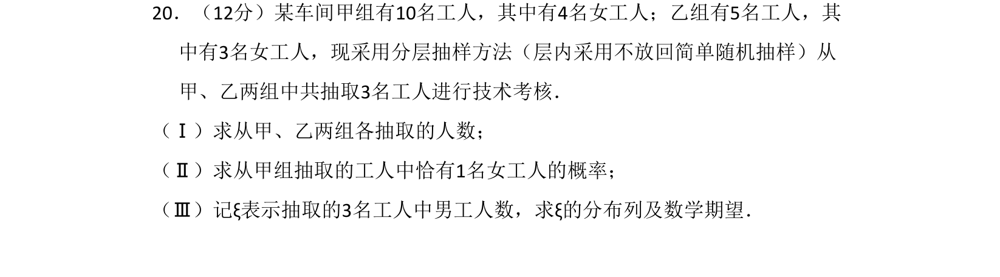
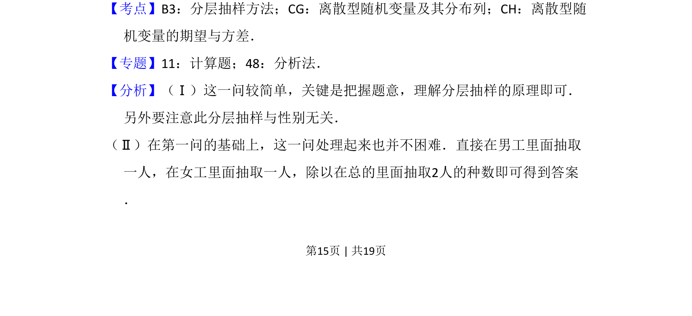
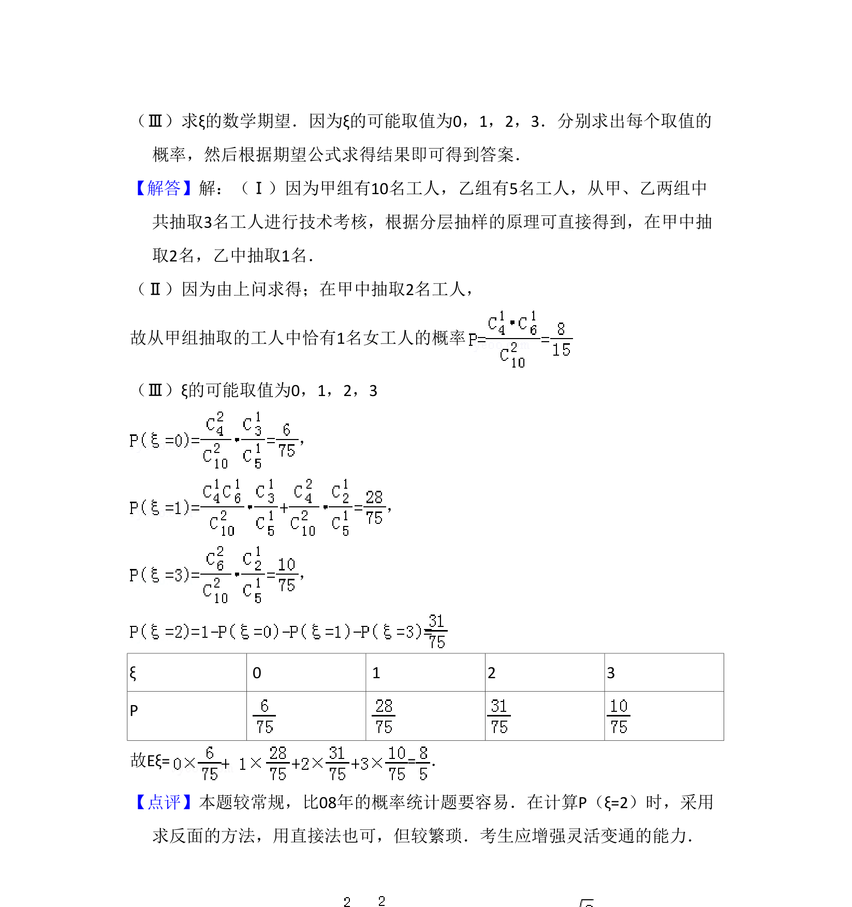

## 题面

## 摘要

该题考查分层抽样方法、组合概率计算以及离散型随机变量分布列与期望的求解。

## 关联考点

- [[319-分层抽样|分层抽样]]
- [[320-古典概型|古典概型]]
- [[1038-离散型随机变量分布列|离散型随机变量分布列]]
- [[501-离散型随机变量期望|数学期望]]

## 答案与解析

> 📄 原 PDF 第 15 页：`素材/真题/吉林/2008-2024·（吉林）数学高考真题/2009年高考数学试卷（理）（全国卷Ⅱ）（解析卷）.pdf`
