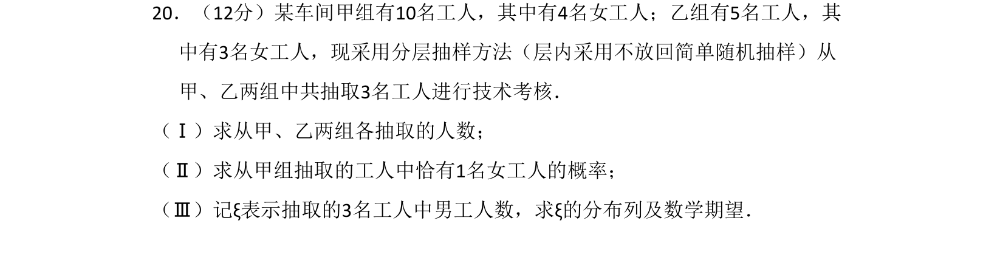
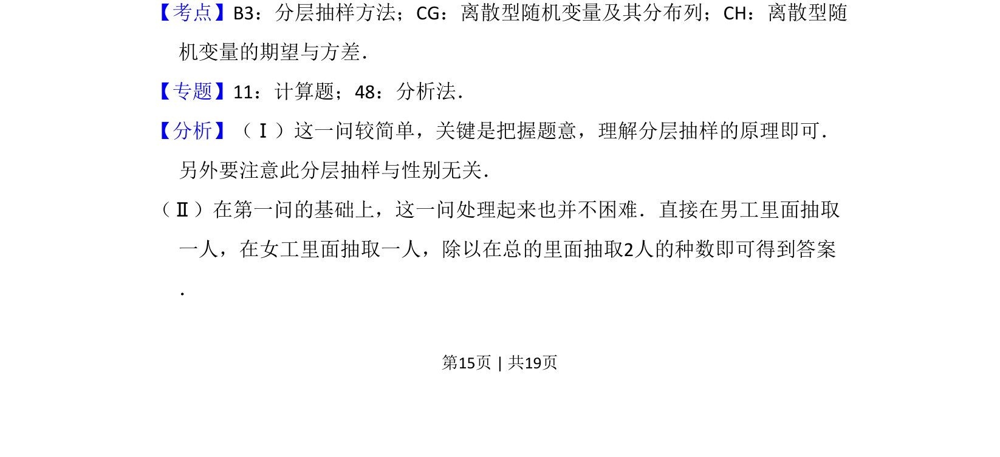
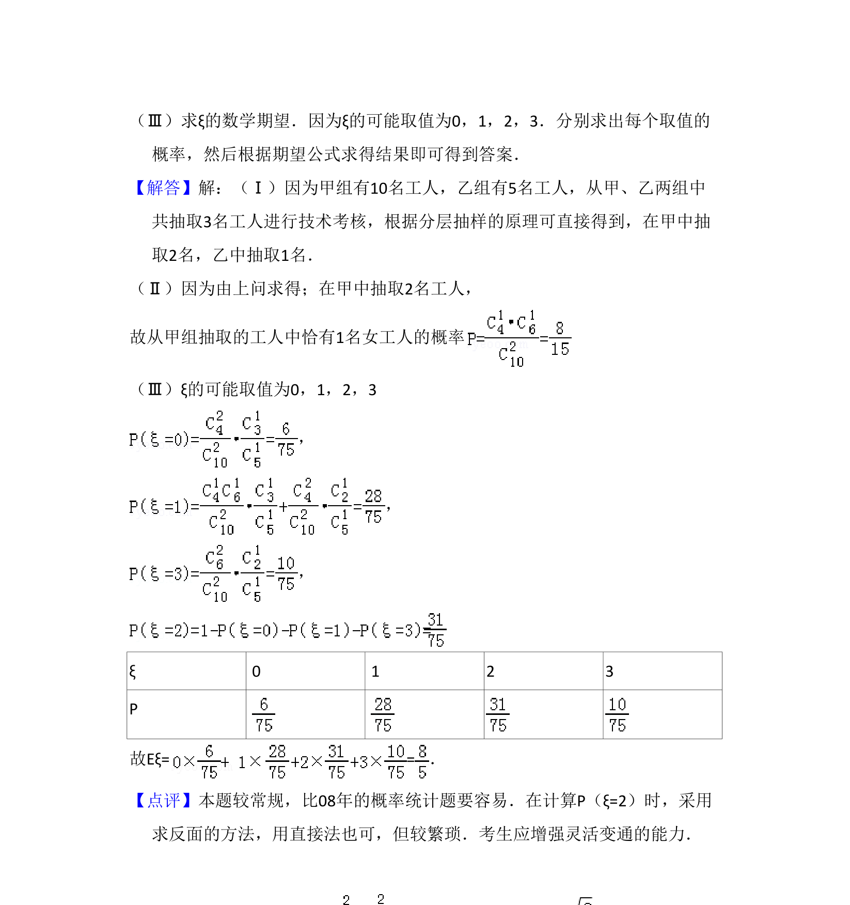

## 题面

## 摘要

该题考查分层抽样方法、组合概率计算以及离散型随机变量分布列与期望的求解。

## 关联考点

- [[319-分层抽样|分层抽样]]
- [[320-古典概型|古典概型]]
- [[1038-离散型随机变量分布列|离散型随机变量分布列]]
- [[501-离散型随机变量期望|数学期望]]

## 答案与解析

> 📄 原 PDF 第 15 页：`素材/真题/吉林/2008-2024·（吉林）数学高考真题/2009年高考数学试卷（理）（全国卷Ⅱ）（解析卷）.pdf`

<!-- 题干文本-start -->
## 题干文本
20．（12分）某车间甲组有10名工人，其中有4名女工人；乙组有5名工人，其
中有3名女工人，现采用分层抽样方法（层内采用不放回简单随机抽样）从
甲、乙两组中共抽取3名工人进行技术考核．
（Ⅰ）求从甲、乙两组各抽取的人数；
（Ⅱ）求从甲组抽取的工人中恰有1名女工人的概率；
（Ⅲ）记ξ表示抽取的3名工人中男工人数，求ξ的分布列及数学期望．
<!-- 题干文本-end -->

<!-- 解析文本-start -->
## 解析文本
【考点】B3：分层抽样方法；CG：离散型随机变量及其分布列；CH：离散型随
机变量的期望与方差．菁优网版权所有
【专题】11：计算题；48：分析法．
【分析】（Ⅰ）这一问较简单，关键是把握题意，理解分层抽样的原理即可．
另外要注意此分层抽样与性别无关．
（Ⅱ）在第一问的基础上，这一问处理起来也并不困难．直接在男工里面抽取
一人，在女工里面抽取一人，除以在总的里面抽取2人的种数即可得到答案
．
<!-- 解析文本-end -->
