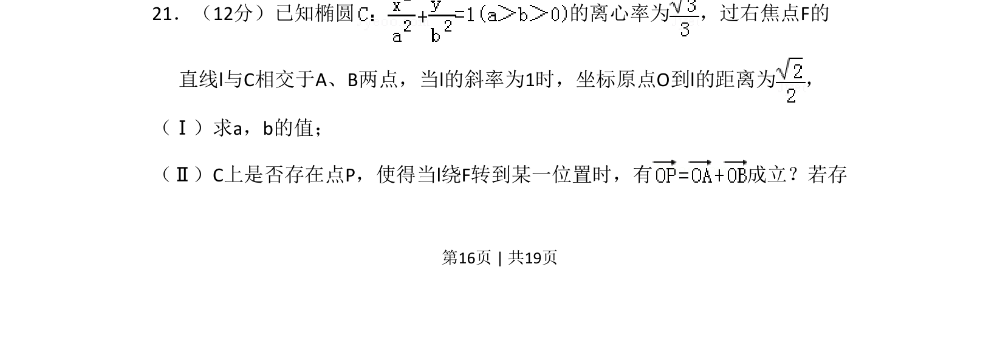
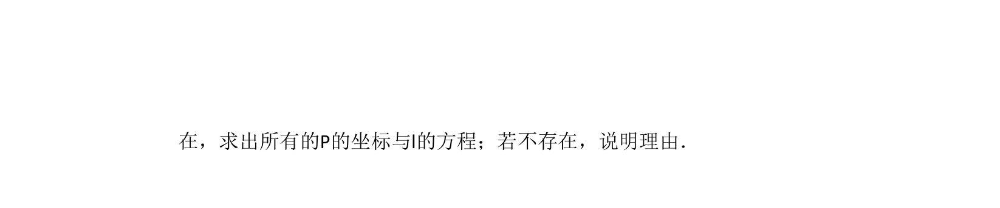
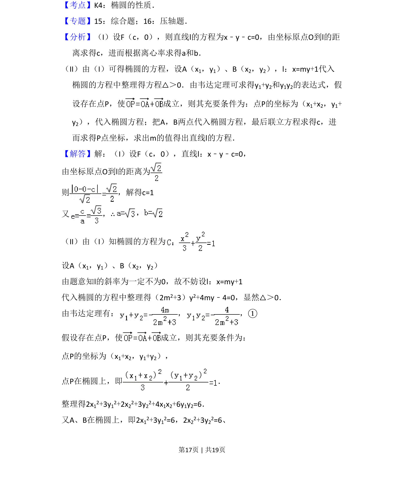
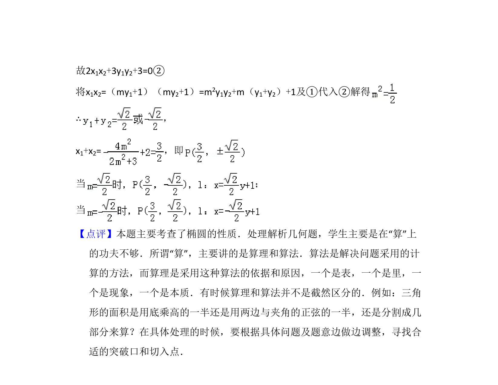

## 题面

## 摘要

椭圆及直线与椭圆综合题，已知离心率和原点到切线距离求椭圆方程，再探究是否存在定点满足向量关系

## 关联考点

- [[061-方程|椭圆的标准方程]]
- [[391-椭圆离心率|离心率]]
- [[980-点到直线的距离|点到直线的距离]]
- [[743-向量共线|向量共线]]

## 答案与解析

> 📄 原 PDF 第 16 页：`素材/真题/吉林/2008-2024·（吉林）数学高考真题/2009年高考数学试卷（理）（全国卷Ⅱ）（解析卷）.pdf`
