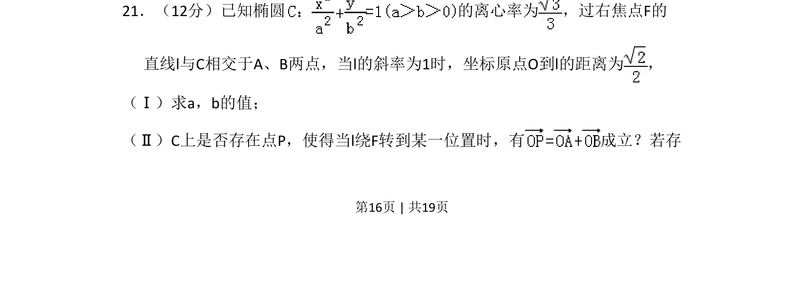
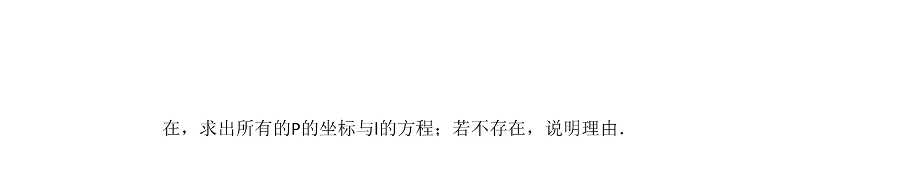
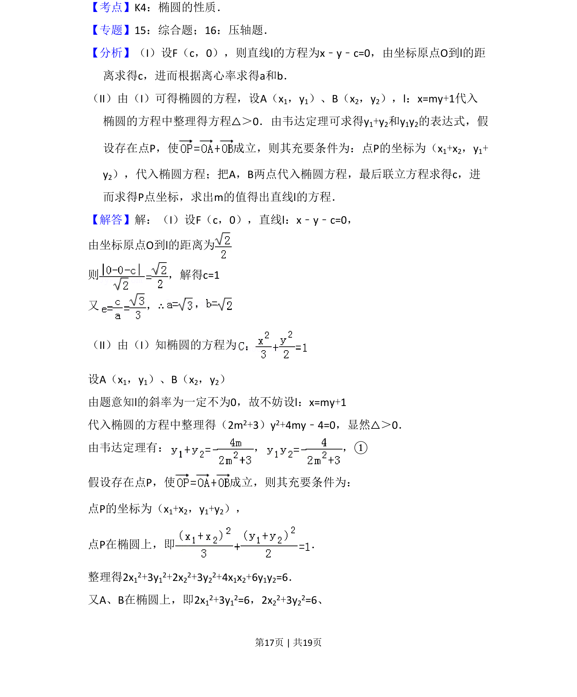
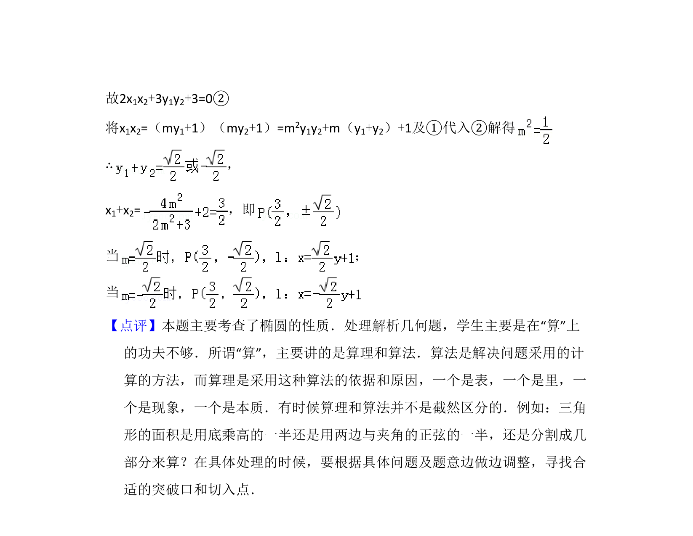

## 题面

## 摘要

椭圆及直线与椭圆综合题，已知离心率和原点到切线距离求椭圆方程，再探究是否存在定点满足向量关系

## 关联考点

- [[061-方程|椭圆的标准方程]]
- [[391-椭圆离心率|离心率]]
- [[1211-点到直线距离|点到直线的距离]]
- [[743-向量共线|向量共线]]

## 答案与解析

> 📄 原 PDF 第 16 页：`素材/真题/吉林/2008-2024·（吉林）数学高考真题/2009年高考数学试卷（理）（全国卷Ⅱ）（解析卷）.pdf`

<!-- 题干文本-start -->
## 题干文本
21．（12分）已知椭圆 的离心率为 ，过右焦点F的
直线l与C相交于A、B两点，当l的斜率为1时，坐标原点O到l的距离为 ，
（Ⅰ）求a，b的值；
（Ⅱ）C上是否存在点P，使得当l绕F转到某一位置时，有 成立？若存
<!-- 题干文本-end -->

<!-- 解析文本-start -->
## 解析文本

<!-- 解析文本-end -->
