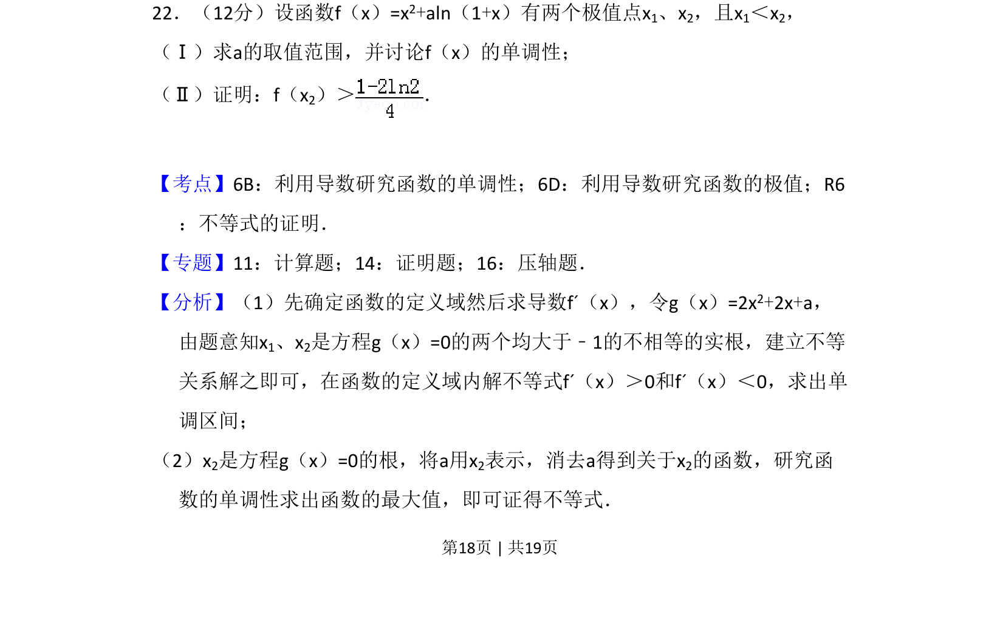

## 题面

## 摘要

本题考查含参函数极值点存在条件、单调性讨论及极值点相关不等式证明。

## 关联考点

- [[利用导数研究函数的单调性]]
- [[利用导数研究函数的极值]]
- [[不等式的证明]]

## 答案与解析

> 📄 原 PDF 第 18 页：`素材/真题/吉林/2008-2024·（吉林）数学高考真题/2009年高考数学试卷（理）（全国卷Ⅱ）（解析卷）.pdf`
