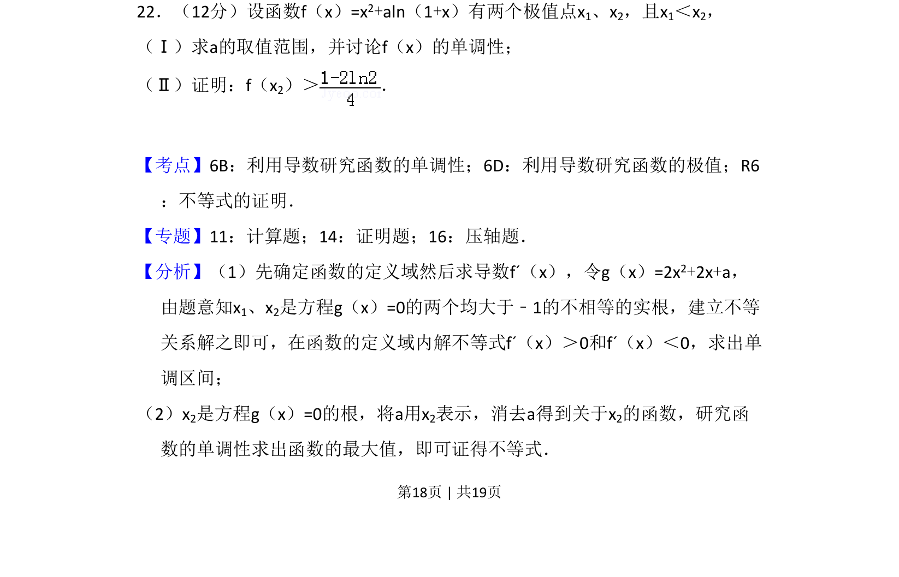
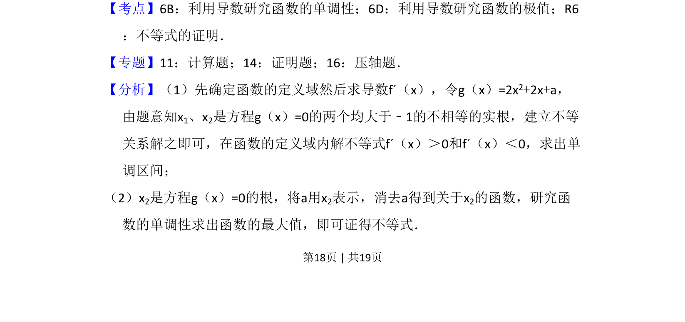
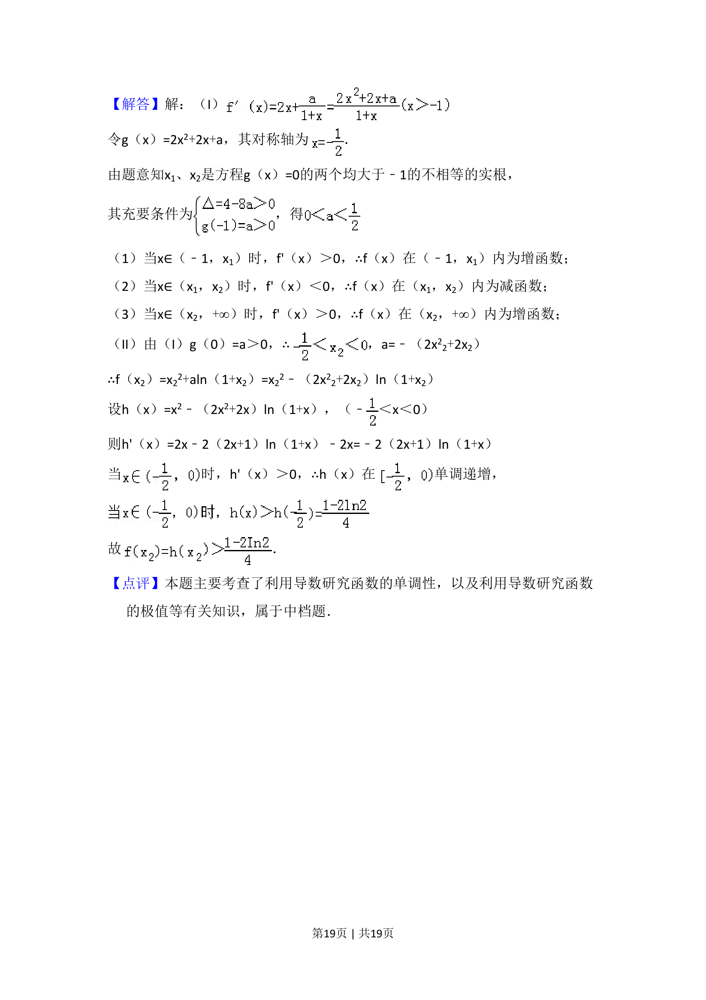

## 题面

## 摘要

本题考查含参函数极值点存在条件、单调性讨论及极值点相关不等式证明。

## 关联考点

- [[705-利用导数研究函数的单调性|利用导数研究函数的单调性]]
- [[707-利用导数研究函数的极值|利用导数研究函数的极值]]
- [[624-不等式的证明|不等式的证明]]

## 答案与解析

> 📄 原 PDF 第 18 页：`素材/真题/吉林/2008-2024·（吉林）数学高考真题/2009年高考数学试卷（理）（全国卷Ⅱ）（解析卷）.pdf`

<!-- 题干文本-start -->
## 题干文本
22．（12分）设函数f（x）=x2+aln（1+x）有两个极值点x1、x2，且x1＜x2，
（Ⅰ）求a的取值范围，并讨论f（x）的单调性；
（Ⅱ）证明：f（x2）＞ ．
<!-- 题干文本-end -->

<!-- 解析文本-start -->
## 解析文本
【考点】6B：利用导数研究函数的单调性；6D：利用导数研究函数的极值；R6
：不等式的证明．菁优网版权所有
【专题】11：计算题；14：证明题；16：压轴题．
【分析】（1）先确定函数的定义域然后求导数fˊ（x），令g（x）=2x2+2x+a，
由题意知x1、x2是方程g（x）=0的两个均大于﹣1的不相等的实根，建立不等
关系解之即可，在函数的定义域内解不等式fˊ（x）＞0和fˊ（x）＜0，求出单
调区间；
（2）x2是方程g（x）=0的根，将a用x2表示，消去a得到关于x2的函数，研究函
数的单调性求出函数的最大值，即可证得不等式．
<!-- 解析文本-end -->
