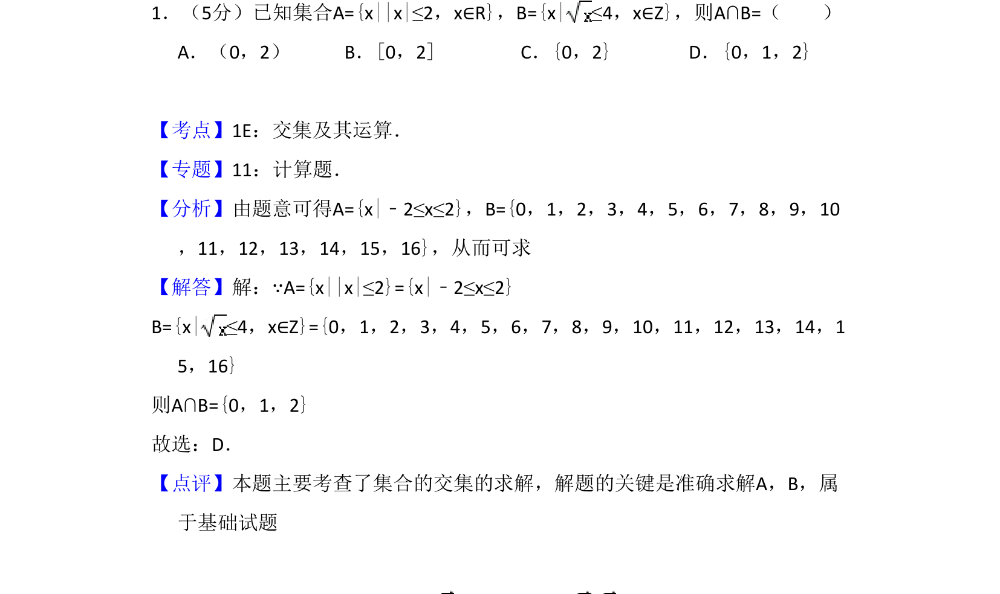
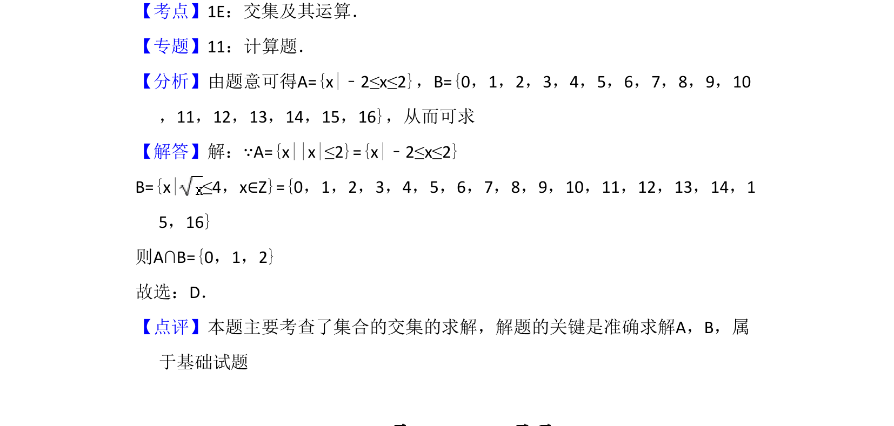

## 题面

## 摘要

本题主要考查含绝对值不等式和根式不等式的集合求解及交集运算。

## 关联考点

- [[645-交集及其运算|交集及其运算]]
- [[1092-绝对值不等式|绝对值不等式]]
- [[931-根式不等式|根式不等式]]

## 答案与解析

> 📄 原 PDF 第 1 页：`素材/真题/吉林/2008-2024·（吉林）数学高考真题/2010年高考数学试卷（文）（新课标）（解析卷）.pdf`
