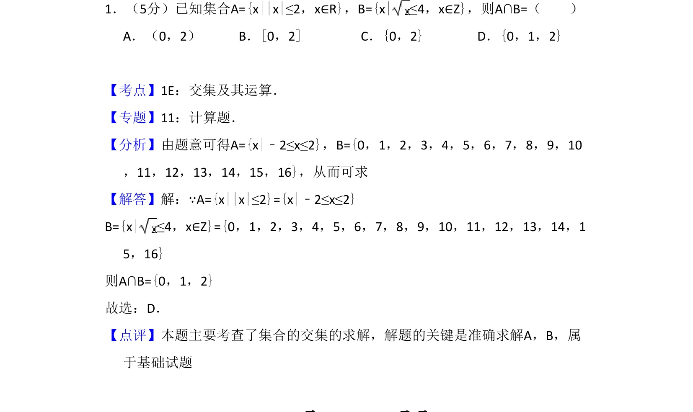
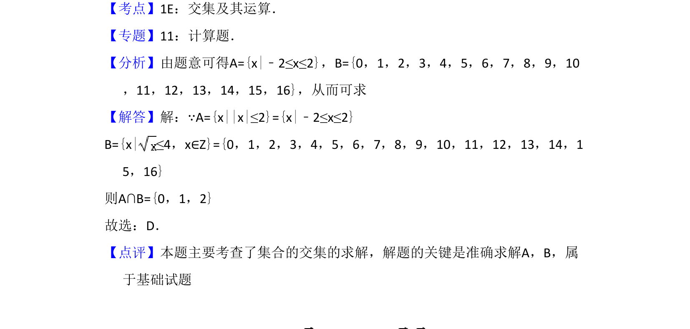

## 题面

## 摘要

本题主要考查含绝对值不等式和根式不等式的集合求解及交集运算。

## 关联考点

- [[645-交集及其运算|交集及其运算]]
- [[1092-绝对值不等式|绝对值不等式]]
- [[931-根式不等式|根式不等式]]

## 答案与解析

> 📄 原 PDF 第 1 页：`素材/真题/吉林/2008-2024·（吉林）数学高考真题/2010年高考数学试卷（文）（新课标）（解析卷）.pdf`

<!-- 题干文本-start -->
## 题干文本
1．（5分）已知集合A={x||x|≤2，x∈R}，B={x|≤4，x∈Z}，则A∩B=（　　）
A．（0，2）B．[0，2]C．{0，2}D．{0，1，2}
<!-- 题干文本-end -->

<!-- 解析文本-start -->
## 解析文本
【考点】1E：交集及其运算．菁优网版权所有
【专题】11：计算题．
【分析】由题意可得A={x|﹣2≤x≤2}，B={0，1，2，3，4，5，6，7，8，9，10
，11，12，13，14，15，16}，从而可求
【解答】解：∵A={x||x|≤2}={x|﹣2≤x≤2}
B={x|≤4，x∈Z}={0，1，2，3，4，5，6，7，8，9，10，11，12，13，14，1
5，16}
则A∩B={0，1，2}
故选：D．
【点评】本题主要考查了集合的交集的求解，解题的关键是准确求解A，B，属
于基础试题
<!-- 解析文本-end -->
