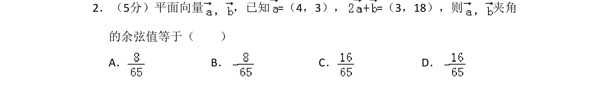
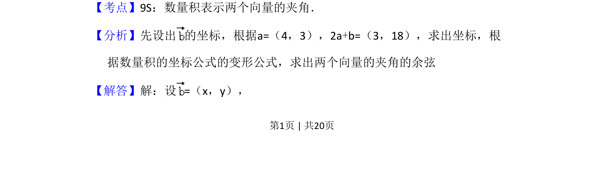
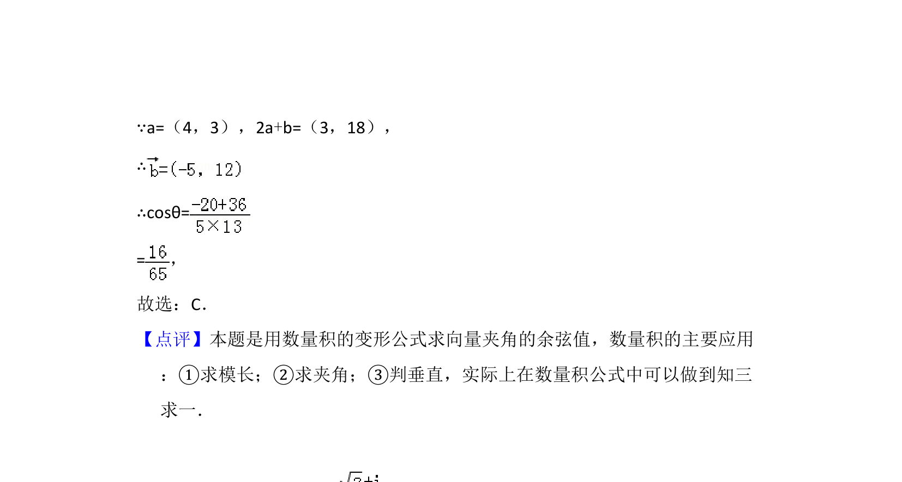

## 题面

## 摘要

本题通过向量坐标运算求两向量夹角的余弦值。

## 关联考点

- [[853-平面向量|平面向量]]
- [[328-向量的数量积|数量积]]
- [[815-夹角余弦|夹角余弦]]

## 答案与解析

> 📄 原 PDF 第 1 页：`素材/真题/吉林/2008-2024·（吉林）数学高考真题/2010年高考数学试卷（文）（新课标）（解析卷）.pdf`

<!-- 题干文本-start -->
## 题干文本
2．（5分）平面向量 ，已知=（4，3），=（3，18），则 夹角
的余弦值等于（　　）
A．B．C．D．
<!-- 题干文本-end -->

<!-- 解析文本-start -->
## 解析文本
【考点】9S：数量积表示两个向量的夹角．菁优网版权所有
【分析】先设出 的坐标，根据a=（4，3），2a+b=（3，18），求出坐标，根
据数量积的坐标公式的变形公式，求出两个向量的夹角的余弦
【解答】解：设=（x，y），
<!-- 解析文本-end -->
