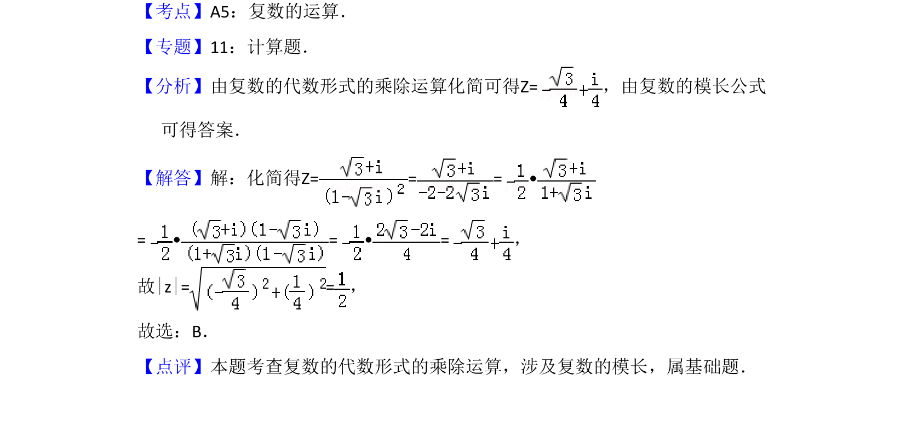

## 题面

## 摘要

已知复数代数形式，通过乘除运算化简并求模长。

## 关联考点

- [[805-复数的四则运算|复数的四则运算]]
- [[803-复数模长|复数的模]]

## 答案与解析

> 📄 原 PDF 第 2 页：`素材/真题/吉林/2008-2024·（吉林）数学高考真题/2010年高考数学试卷（文）（新课标）（解析卷）.pdf`

<!-- 题干文本-start -->
## 题干文本
3．（5分）已知复数Z=，则|z|=（　　）
A．B．C．1 D．2
<!-- 题干文本-end -->

<!-- 解析文本-start -->
## 解析文本
【考点】A5：复数的运算．菁优网版权所有
【专题】11：计算题．
【分析】由复数的代数形式的乘除运算化简可得Z=，由复数的模长公式
可得答案．
【解答】解：化简得Z= = = •
= • = • =，
故|z|= =，
故选：B．
【点评】本题考查复数的代数形式的乘除运算，涉及复数的模长，属基础题．
<!-- 解析文本-end -->
