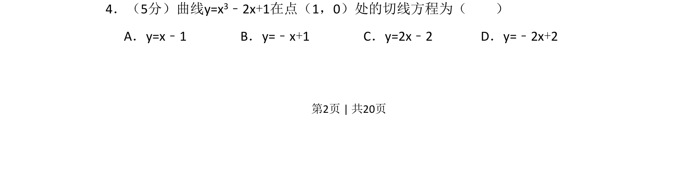
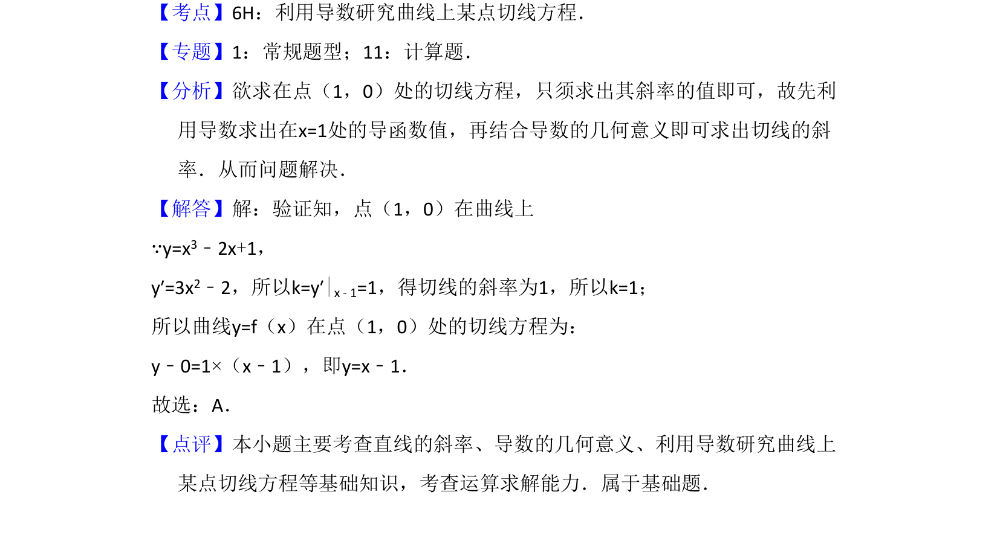

## 题面

## 摘要

考查利用导数求曲线在给定点的切线方程。

## 关联考点

- [[440-导数的几何意义|导数的几何意义]]
- [[422-切线方程|切线方程]]
- [[398-直线方程-点斜式|点斜式]]

## 答案与解析

> 📄 原 PDF 第 2 页：`素材/真题/吉林/2008-2024·（吉林）数学高考真题/2010年高考数学试卷（文）（新课标）（解析卷）.pdf`
