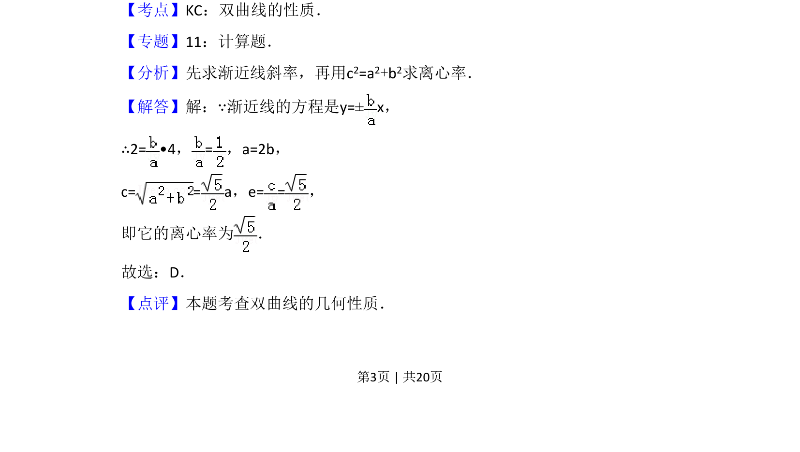

## 题面

## 摘要

求双曲线渐近线经过给定点时的离心率

## 关联考点

- [[731-双曲线的性质|双曲线的性质]]
- [[369-双曲线渐近线|渐近线]]
- [[391-椭圆离心率|离心率]]

## 答案与解析

> 📄 原 PDF 第 3 页：`素材/真题/吉林/2008-2024·（吉林）数学高考真题/2010年高考数学试卷（文）（新课标）（解析卷）.pdf`

<!-- 题干文本-start -->
## 题干文本
5．（5分）中心在原点，焦点在x轴上的双曲线的一条渐近线经过点（4，2），
则它的离心率为（　　）
A．B．C．D．
<!-- 题干文本-end -->

<!-- 解析文本-start -->
## 解析文本
【考点】KC：双曲线的性质．菁优网版权所有
【专题】11：计算题．
【分析】先求渐近线斜率，再用c2=a2+b2求离心率．
【解答】解：∵渐近线的方程是y=±x，
∴2= •4，=，a=2b，
c= = a，e= =，
即它的离心率为 ．
故选：D．
【点评】本题考查双曲线的几何性质．
<!-- 解析文本-end -->
