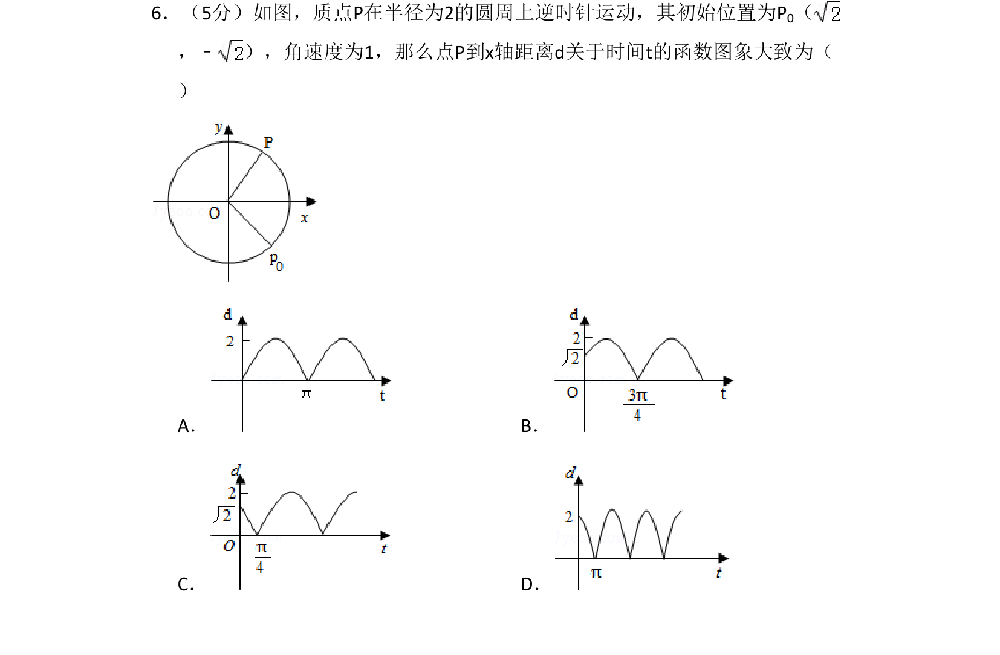
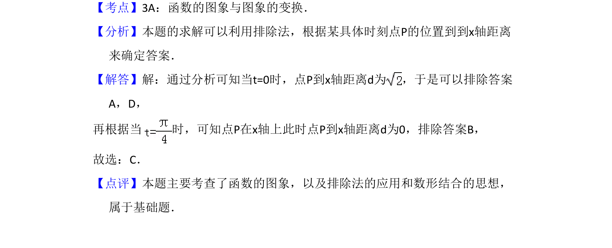

## 题面

## 摘要

质点P在圆周上逆时针运动，求其到x轴距离d关于时间t的函数图象。

## 关联考点

- [[688-函数的图象与图象变换|函数的图象与图象变换]]
- [[032-除法|排除法]]
- [[897-数形结合|数形结合]]

## 答案与解析

> 📄 原 PDF 第 4 页：`素材/真题/吉林/2008-2024·（吉林）数学高考真题/2010年高考数学试卷（文）（新课标）（解析卷）.pdf`
