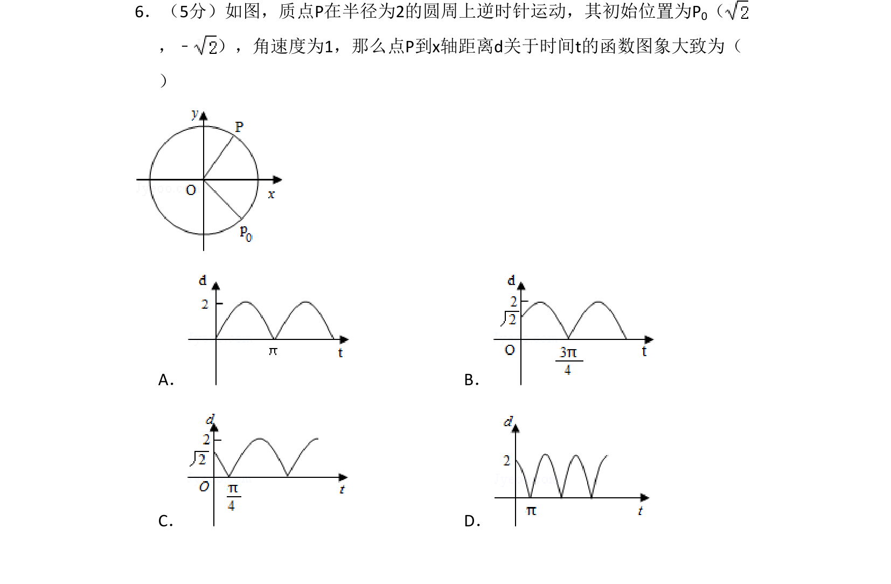
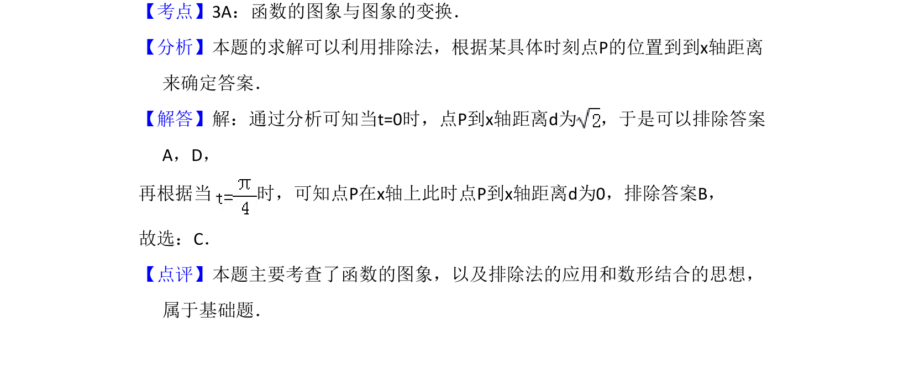

## 题面

## 摘要

质点P在圆周上逆时针运动，求其到x轴距离d关于时间t的函数图象。

## 关联考点

- [[689-函数的图象与图象的变换|函数的图象与图象变换]]
- [[032-除法|排除法]]
- [[897-数形结合|数形结合]]

## 答案与解析

> 📄 原 PDF 第 4 页：`素材/真题/吉林/2008-2024·（吉林）数学高考真题/2010年高考数学试卷（文）（新课标）（解析卷）.pdf`

<!-- 题干文本-start -->
## 题干文本
6．（5分）如图，质点P在半径为2的圆周上逆时针运动，其初始位置为P0（
，﹣ ），角速度为1，那么点P到x轴距离d关于时间t的函数图象大致为（　　
）
A．B．
C．D．
<!-- 题干文本-end -->

<!-- 解析文本-start -->
## 解析文本
【考点】3A：函数的图象与图象的变换．菁优网版权所有
【分析】本题的求解可以利用排除法，根据某具体时刻点P的位置到到x轴距离
来确定答案．
【解答】解：通过分析可知当t=0时，点P到x轴距离d为 ，于是可以排除答案
A，D，
再根据当 时，可知点P在x轴上此时点P到x轴距离d为0，排除答案B，
故选：C．
【点评】本题主要考查了函数的图象，以及排除法的应用和数形结合的思想，
属于基础题．
<!-- 解析文本-end -->
