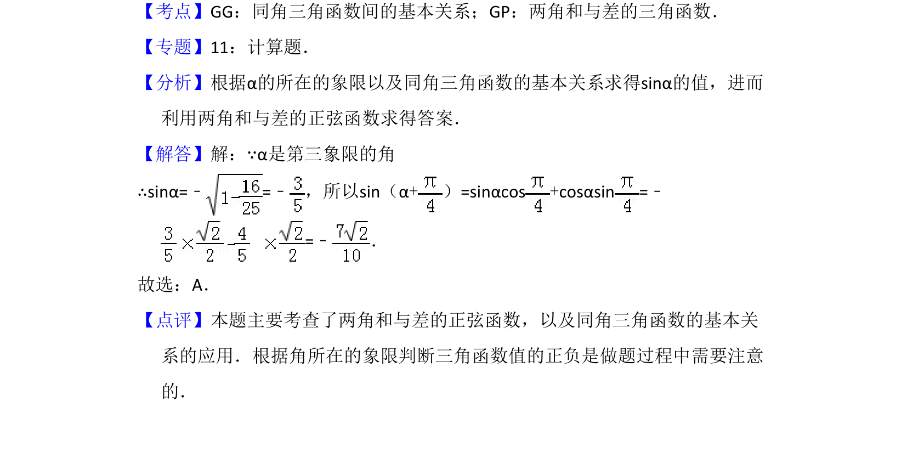

## 题面

## 摘要

已知角α的余弦值及象限，求其正弦并利用两角和公式计算正弦值。

## 关联考点

- [[741-同角三角函数基本关系|同角三角函数基本关系]]
- [[631-两角和与差的正弦函数|两角和与差的正弦函数]]

## 答案与解析

> 📄 原 PDF 第 7 页：`素材/真题/吉林/2008-2024·（吉林）数学高考真题/2010年高考数学试卷（文）（新课标）（解析卷）.pdf`

<!-- 题干文本-start -->
## 题干文本
10．（5分）若cos α=﹣ ，α是第三象限的角，则sin（α+）=（　　）
A．B．C．D．
<!-- 题干文本-end -->

<!-- 解析文本-start -->
## 解析文本
【考点】GG：同角三角函数间的基本关系；GP：两角和与差的三角函数．菁优网版权所有
【专题】11：计算题．
【分析】根据α的所在的象限以及同角三角函数的基本关系求得sinα的值，进而
利用两角和与差的正弦函数求得答案．
【解答】解：∵α是第三象限的角
∴sinα=﹣=﹣ ，所以sin（α+）=sinαcos+cosαsin=﹣
=﹣ ．
故选：A．
【点评】本题主要考查了两角和与差的正弦函数，以及同角三角函数的基本关
系的应用．根据角所在的象限判断三角函数值的正负是做题过程中需要注意
的．
<!-- 解析文本-end -->
