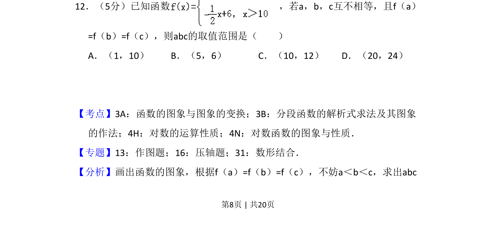

## 题面

## 摘要

本题考查分段函数与对数函数图象性质，利用数形结合求参数乘积的取值范围。

## 关联考点

- [[290-分段函数|分段函数]]
- [[298-对数函数|对数函数]]
- [[187-函数图象|函数图象]]
- [[数形结合]]

## 答案与解析

> 📄 原 PDF 第 8 页：`素材/真题/吉林/2008-2024·（吉林）数学高考真题/2010年高考数学试卷（文）（新课标）（解析卷）.pdf`
