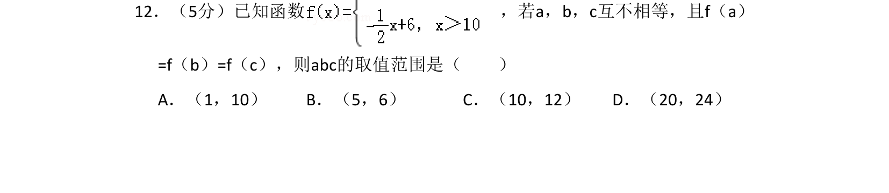
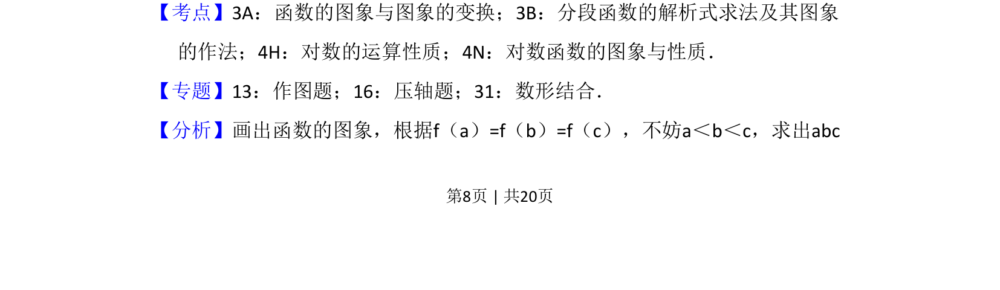
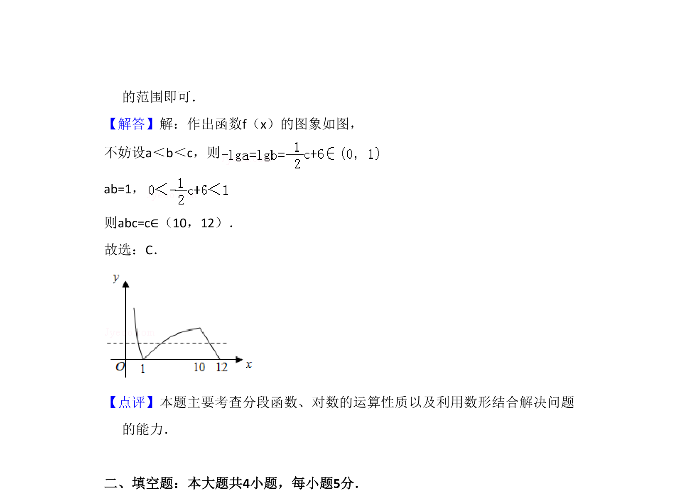

## 题面

## 摘要

本题考查分段函数与对数函数图象性质，利用数形结合求参数乘积的取值范围。

## 关联考点

- [[290-分段函数|分段函数]]
- [[298-对数函数|对数函数]]
- [[187-函数图象|函数图象]]
- [[897-数形结合|数形结合]]

## 答案与解析

> 📄 原 PDF 第 8 页：`素材/真题/吉林/2008-2024·（吉林）数学高考真题/2010年高考数学试卷（文）（新课标）（解析卷）.pdf`

<!-- 题干文本-start -->
## 题干文本
12．（5分）已知函数 ，若a，b，c互不相等，且f（a）
=f（b）=f（c），则abc的取值范围是（　　）
A．（1，10）B．（5，6）C．（10，12）D．（20，24）
<!-- 题干文本-end -->

<!-- 解析文本-start -->
## 解析文本
【考点】3A：函数的图象与图象的变换；3B：分段函数的解析式求法及其图象
的作法；4H：对数的运算性质；4N：对数函数的图象与性质．菁优网版权所有
【专题】13：作图题；16：压轴题；31：数形结合．
【分析】画出函数的图象，根据f（a）=f（b）=f（c），不妨a＜b＜c，求出abc
<!-- 解析文本-end -->
