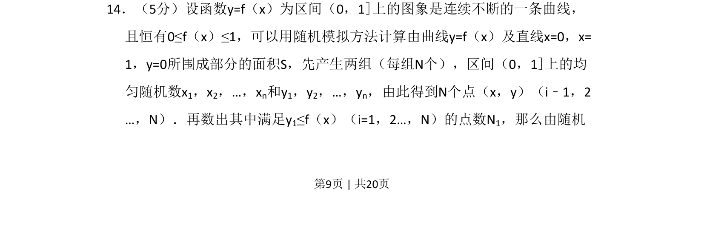
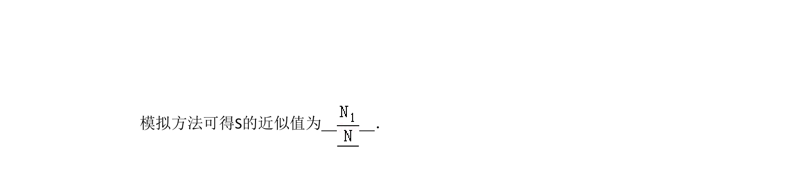
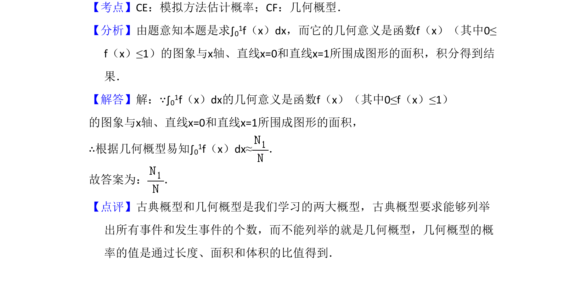

## 题面

## 摘要

本题通过随机模拟方法计算曲线下方面积，考查几何概型与定积分的近似计算。

## 关联考点

- [[667-几何概型|几何概型]]
- [[596-随机模拟|随机模拟]]
- [[824-定积分面积|定积分面积]]

## 答案与解析

> 📄 原 PDF 第 9 页：`素材/真题/吉林/2008-2024·（吉林）数学高考真题/2010年高考数学试卷（文）（新课标）（解析卷）.pdf`
