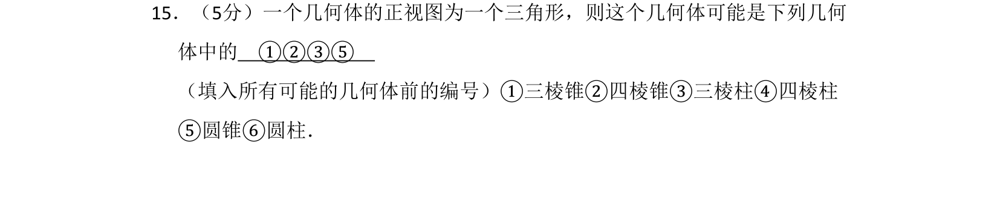
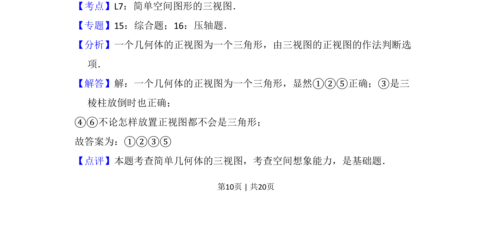

## 题面

## 摘要

根据正视图为三角形，判断哪些几何体可能满足该条件。

## 关联考点

- [[235-三视图|三视图]]
- [[1045-空间几何体|空间几何体]]
- [[1183-直观想象|直观想象]]

## 答案与解析

> 📄 原 PDF 第 10 页：`素材/真题/吉林/2008-2024·（吉林）数学高考真题/2010年高考数学试卷（文）（新课标）（解析卷）.pdf`

<!-- 题干文本-start -->
## 题干文本
15．（5分）一个几何体的正视图为一个三角形，则这个几何体可能是下列几何
体中的　①②③⑤　
（填入所有可能的几何体前的编号）①三棱锥②四棱锥③三棱柱④四棱柱
⑤圆锥⑥圆柱．
<!-- 题干文本-end -->

<!-- 解析文本-start -->
## 解析文本
【考点】L7：简单空间图形的三视图．菁优网版权所有
【专题】15：综合题；16：压轴题．
【分析】一个几何体的正视图为一个三角形，由三视图的正视图的作法判断选
项．
【解答】解：一个几何体的正视图为一个三角形，显然①②⑤正确；③是三
棱柱放倒时也正确；
④⑥不论怎样放置正视图都不会是三角形；
故答案为：①②③⑤
【点评】本题考查简单几何体的三视图，考查空间想象能力，是基础题．
<!-- 解析文本-end -->
