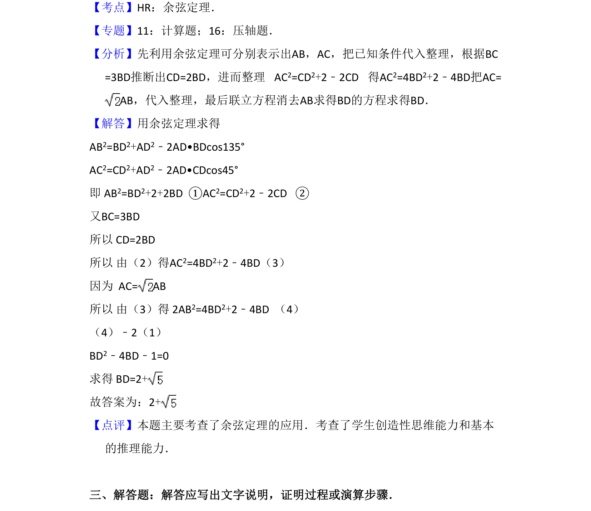

## 题面

## 摘要

本题考查利用余弦定理建立方程，结合几何条件求解三角形边长。

## 关联考点

- [[126-定理|余弦定理]]
- [[906-方程思想|方程思想]]
- [[671-几何计算|几何计算]]

## 答案与解析

> 📄 原 PDF 第 11 页：`素材/真题/吉林/2008-2024·（吉林）数学高考真题/2010年高考数学试卷（文）（新课标）（解析卷）.pdf`
