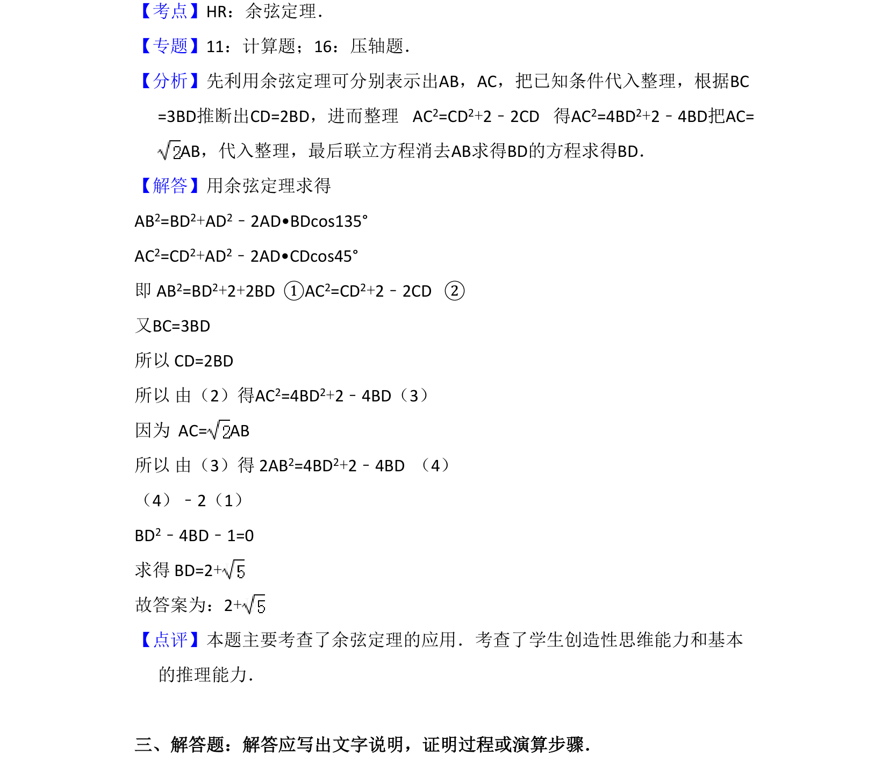

## 题面

## 摘要

本题考查利用余弦定理建立方程，结合几何条件求解三角形边长。

## 关联考点

- [[126-定理|余弦定理]]
- [[906-方程思想|方程思想]]
- [[671-几何计算|几何计算]]

## 答案与解析

> 📄 原 PDF 第 11 页：`素材/真题/吉林/2008-2024·（吉林）数学高考真题/2010年高考数学试卷（文）（新课标）（解析卷）.pdf`

<!-- 题干文本-start -->
## 题干文本
16．（5分）在△ABC中，D为BC边上一点，BC=3BD，AD=，∠ADB=135°．若A
C= AB，则BD=　2+ 　．
<!-- 题干文本-end -->

<!-- 解析文本-start -->
## 解析文本
【考点】HR：余弦定理．菁优网版权所有
【专题】11：计算题；16：压轴题．
【分析】先利用余弦定理可分别表示出AB，AC，把已知条件代入整理，根据BC
=3BD推断出CD=2BD，进而整理 AC 2=CD2+2﹣2CD 得AC 2=4BD2+2﹣4BD把AC=
AB，代入整理，最后联立方程消去AB求得BD的方程求得BD．
【解答】用余弦定理求得
AB2=BD2+AD2﹣2AD•BDcos135°
AC2=CD2+AD2﹣2AD•CDcos45°
即 AB2=BD2+2+2BD  ①AC2=CD2+2﹣2CD   ②
又BC=3BD
所以 CD=2BD
所以 由（2）得AC2=4BD2+2﹣4BD（3）
因为  AC= AB
所以 由（3）得 2AB2=4BD2+2﹣4BD  （4）
（4）﹣2（1）
BD2﹣4BD﹣1=0
求得 BD=2+
故答案为：2+
【点评】本题主要考查了余弦定理的应用．考查了学生创造性思维能力和基本
的推理能力．
　
三、解答题：解答应写出文字说明，证明过程或演算步骤．
<!-- 解析文本-end -->
