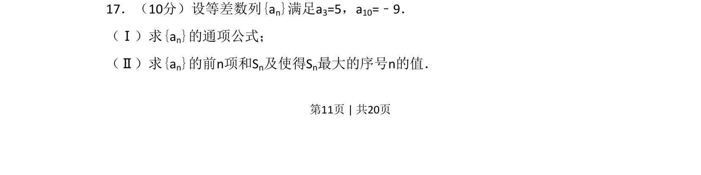
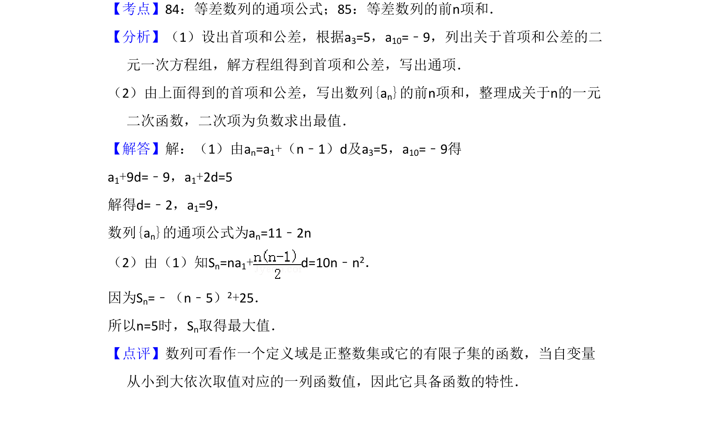

## 题面

## 摘要

本题考查等差数列通项公式求解及前n项和最值问题。

## 关联考点

- [[356-等差数列概念|等差数列]]
- [[384-数列通项公式|通项公式]]
- [[355-等差数列前n项和|前n项和]]
- [[640-二次函数最值|二次函数最值]]

## 答案与解析

> 📄 原 PDF 第 11 页：`素材/真题/吉林/2008-2024·（吉林）数学高考真题/2010年高考数学试卷（文）（新课标）（解析卷）.pdf`
