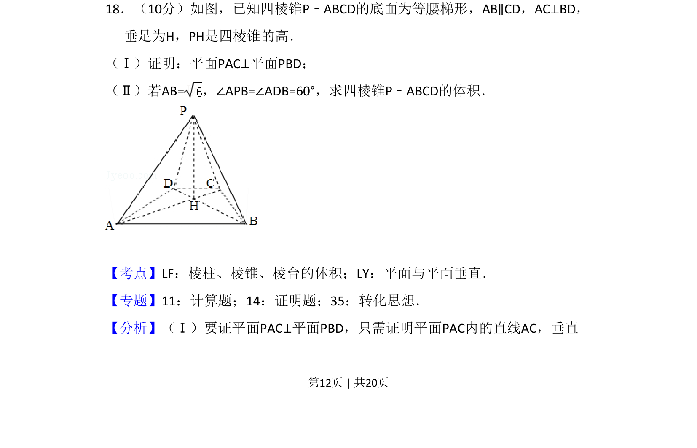
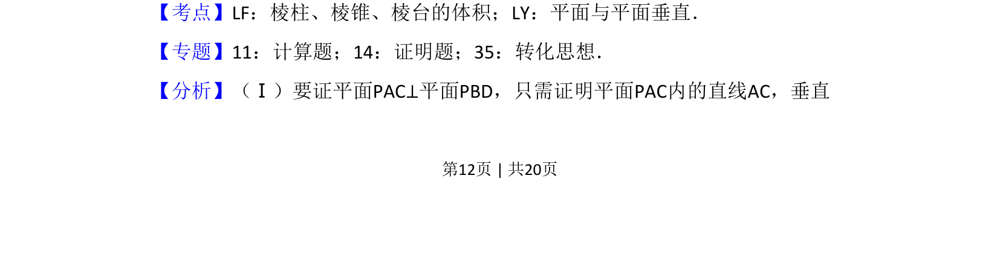
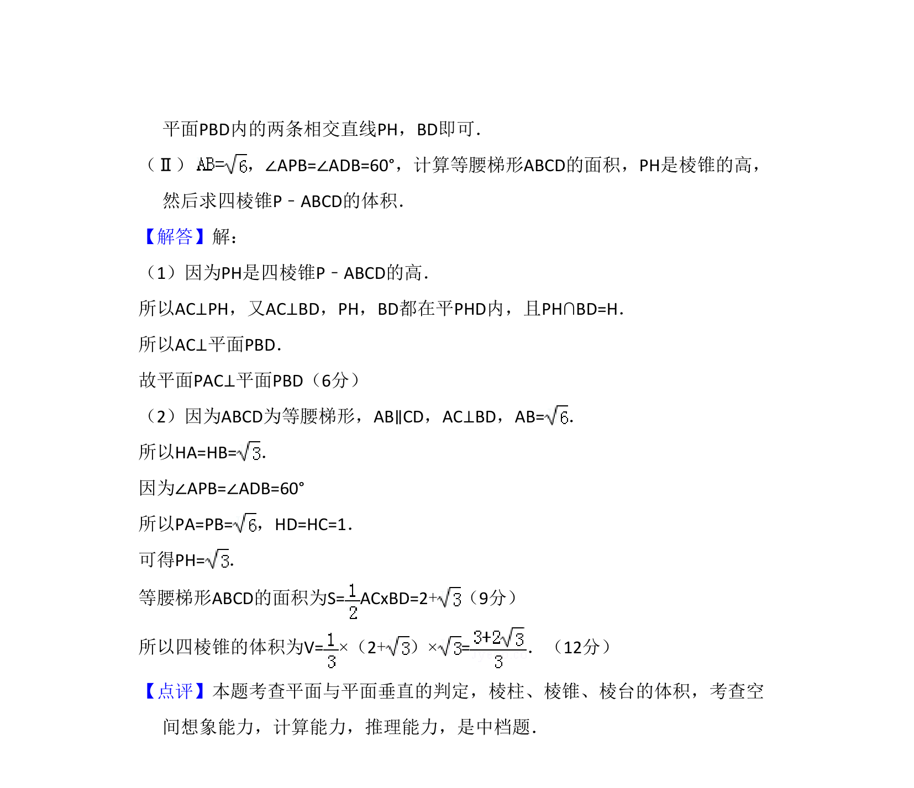

## 题面

## 摘要

考查四棱锥中面面垂直的证明及已知角度和边长求体积

## 关联考点

- [[351-空间直线平面垂直|面面垂直]]
- [[937-棱锥体积|棱锥体积]]
- [[1053-空间垂直关系|空间垂直关系]]

## 答案与解析

> 📄 原 PDF 第 12 页：`素材/真题/吉林/2008-2024·（吉林）数学高考真题/2010年高考数学试卷（文）（新课标）（解析卷）.pdf`
