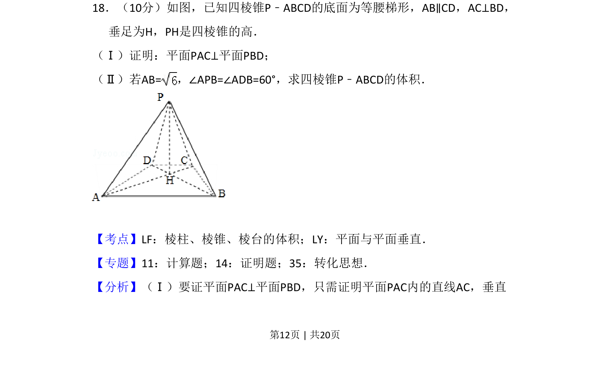
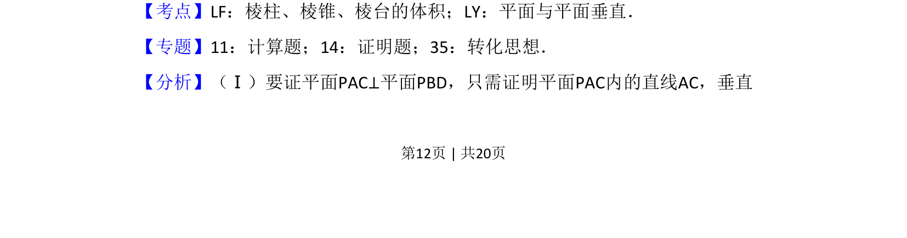
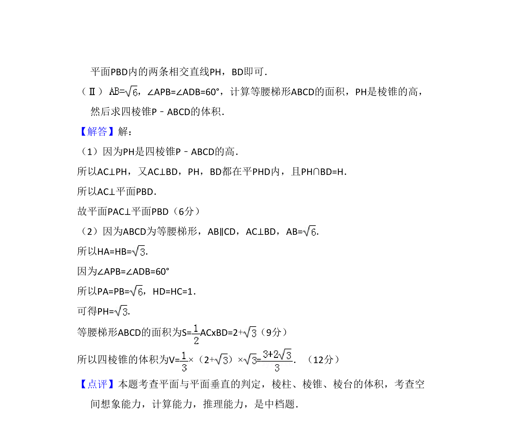

## 题面

## 摘要

考查四棱锥中面面垂直的证明及已知角度和边长求体积

## 关联考点

- [[351-空间直线平面垂直|面面垂直]]
- [[936-棱锥体积|棱锥体积]]
- [[1052-空间垂直关系|空间垂直关系]]

## 答案与解析

> 📄 原 PDF 第 12 页：`素材/真题/吉林/2008-2024·（吉林）数学高考真题/2010年高考数学试卷（文）（新课标）（解析卷）.pdf`

<!-- 题干文本-start -->
## 题干文本
18．（10分）如图，已知四棱锥P﹣ABCD的底面为等腰梯形，AB∥CD，AC⊥BD，
垂足为H，PH是四棱锥的高．
（Ⅰ）证明：平面PAC⊥平面PBD；
（Ⅱ）若AB=，∠APB=∠ADB=60°，求四棱锥P﹣ABCD的体积．
<!-- 题干文本-end -->

<!-- 解析文本-start -->
## 解析文本
【考点】LF：棱柱、棱锥、棱台的体积；LY：平面与平面垂直．菁优网版权所有
【专题】11：计算题；14：证明题；35：转化思想．
【分析】（Ⅰ）要证平面PAC⊥平面PBD，只需证明平面PAC内的直线AC，垂直
<!-- 解析文本-end -->
