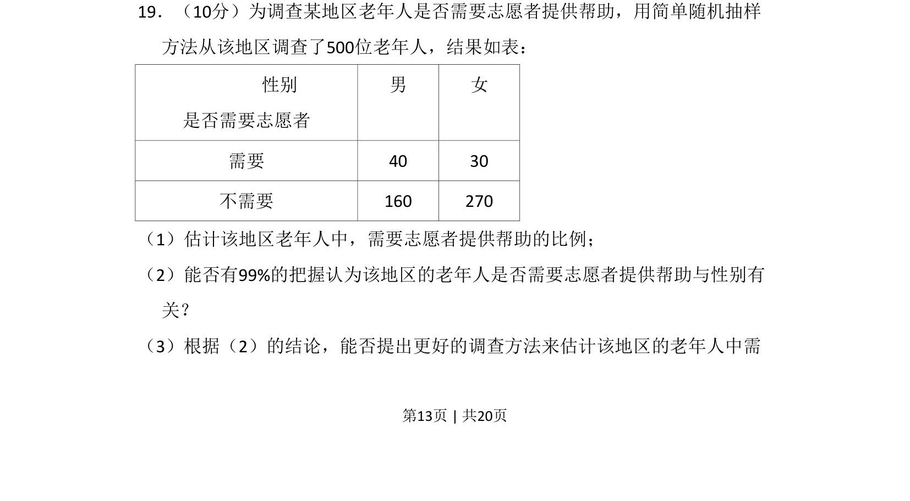

## 题面

## 摘要

本题考查独立性检验与比例估计，基于列联表进行假设检验并评价调查方法。

## 关联考点

- [[497-独立性检验|独立性检验]]
- [[比例估计]]
- [[465-2x2列联表|列联表]]

## 答案与解析

> 📄 原 PDF 第 13 页：`素材/真题/吉林/2008-2024·（吉林）数学高考真题/2010年高考数学试卷（文）（新课标）（解析卷）.pdf`
