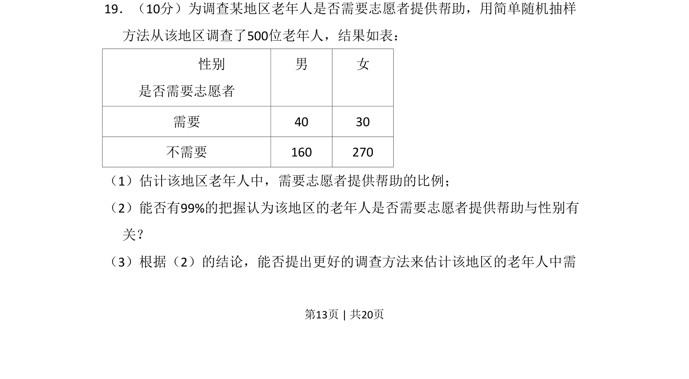
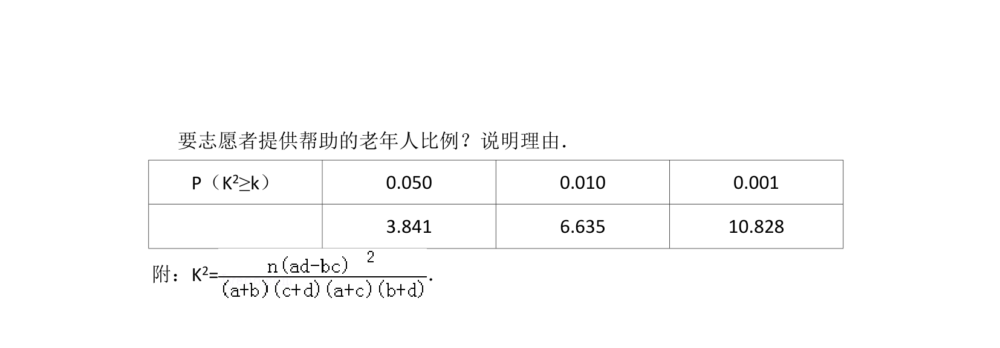
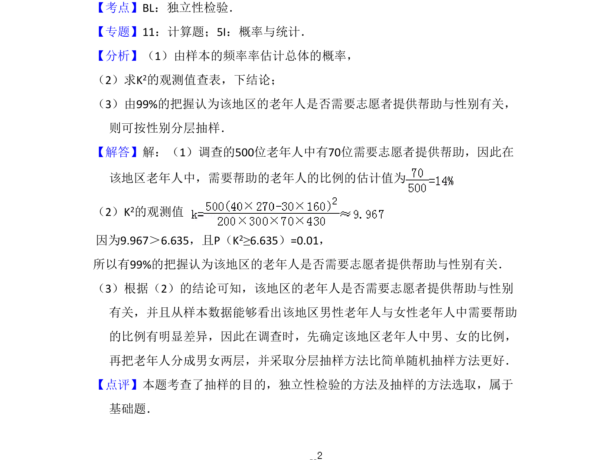

## 题面

## 摘要

本题考查独立性检验与比例估计，基于列联表进行假设检验并评价调查方法。

## 关联考点

- [[497-独立性检验|独立性检验]]
- [[1208-比例估计|比例估计]]
- [[465-2x2列联表|列联表]]

## 答案与解析

> 📄 原 PDF 第 13 页：`素材/真题/吉林/2008-2024·（吉林）数学高考真题/2010年高考数学试卷（文）（新课标）（解析卷）.pdf`

<!-- 题干文本-start -->
## 题干文本
19．（10分）为调查某地区老年人是否需要志愿者提供帮助，用简单随机抽样
方法从该地区调查了500位老年人，结果如表：
                性别
是否需要志愿者
男 女
需要 40 30
不需要 160 270
（1）估计该地区老年人中，需要志愿者提供帮助的比例；
（2）能否有99%的把握认为该地区的老年人是否需要志愿者提供帮助与性别有
关？
（3）根据（2）的结论，能否提出更好的调查方法来估计该地区的老年人中需
<!-- 题干文本-end -->

<!-- 解析文本-start -->
## 解析文本

<!-- 解析文本-end -->
