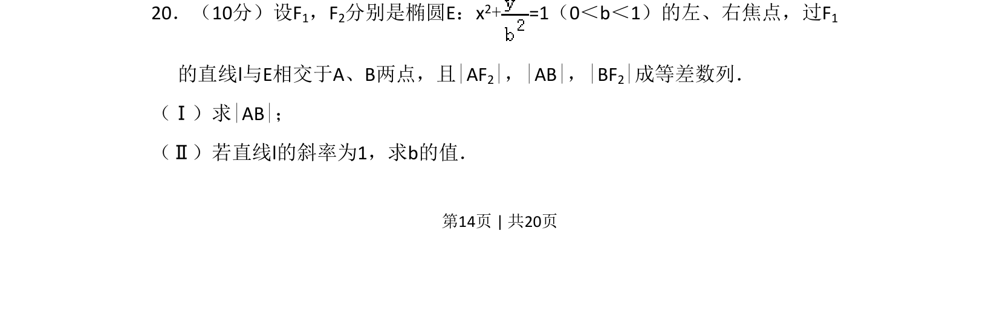
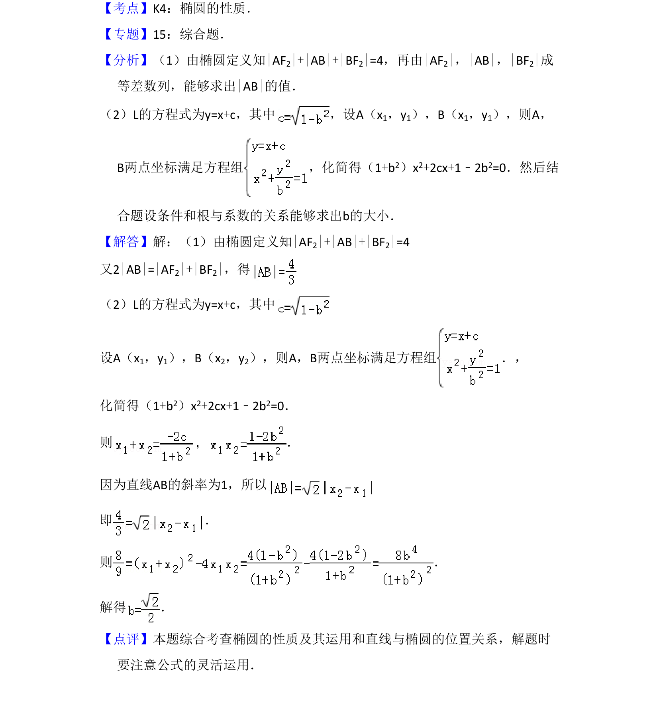

## 题面

## 摘要

椭圆中焦点弦长计算，结合等差数列性质求弦长和椭圆参数。

## 关联考点

- [[389-椭圆定义与方程|椭圆]]
- [[356-等差数列概念|等差数列]]
- [[866-弦长|弦长]]
- [[393-直线倾斜角与斜率|斜率]]

## 答案与解析

> 📄 原 PDF 第 14 页：`素材/真题/吉林/2008-2024·（吉林）数学高考真题/2010年高考数学试卷（文）（新课标）（解析卷）.pdf`

<!-- 题干文本-start -->
## 题干文本
20．（10分）设F1，F2分别是椭圆E：x2+=1（0＜b＜1）的左、右焦点，过F 1
的直线l与E相交于A、B两点，且|AF2|，|AB|，|BF2|成等差数列．
（Ⅰ）求|AB|；
（Ⅱ）若直线l的斜率为1，求b的值．
<!-- 题干文本-end -->

<!-- 解析文本-start -->
## 解析文本

<!-- 解析文本-end -->
