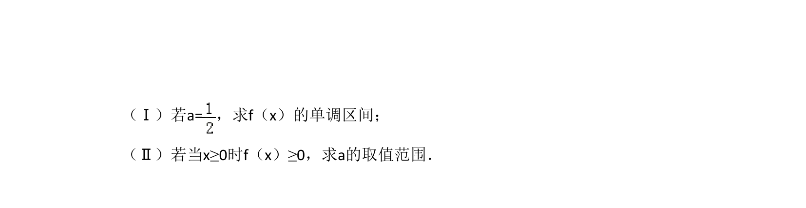
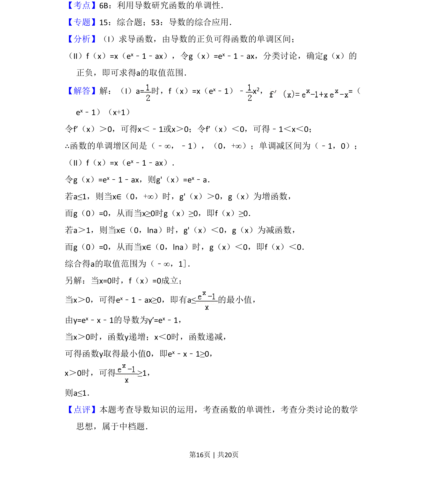

## 题面

## 摘要

考查含参函数单调性、极值问题，利用导数讨论参数取值范围

## 关联考点

- [[549-导数运算|导数运算]]
- [[432-导数与函数单调性|函数单调性]]
- [[594-参数讨论|参数讨论]]
- [[424-参数分类讨论|分类讨论]]

## 答案与解析

> 📄 原 PDF 第 15 页：`素材/真题/吉林/2008-2024·（吉林）数学高考真题/2010年高考数学试卷（文）（新课标）（解析卷）.pdf`
