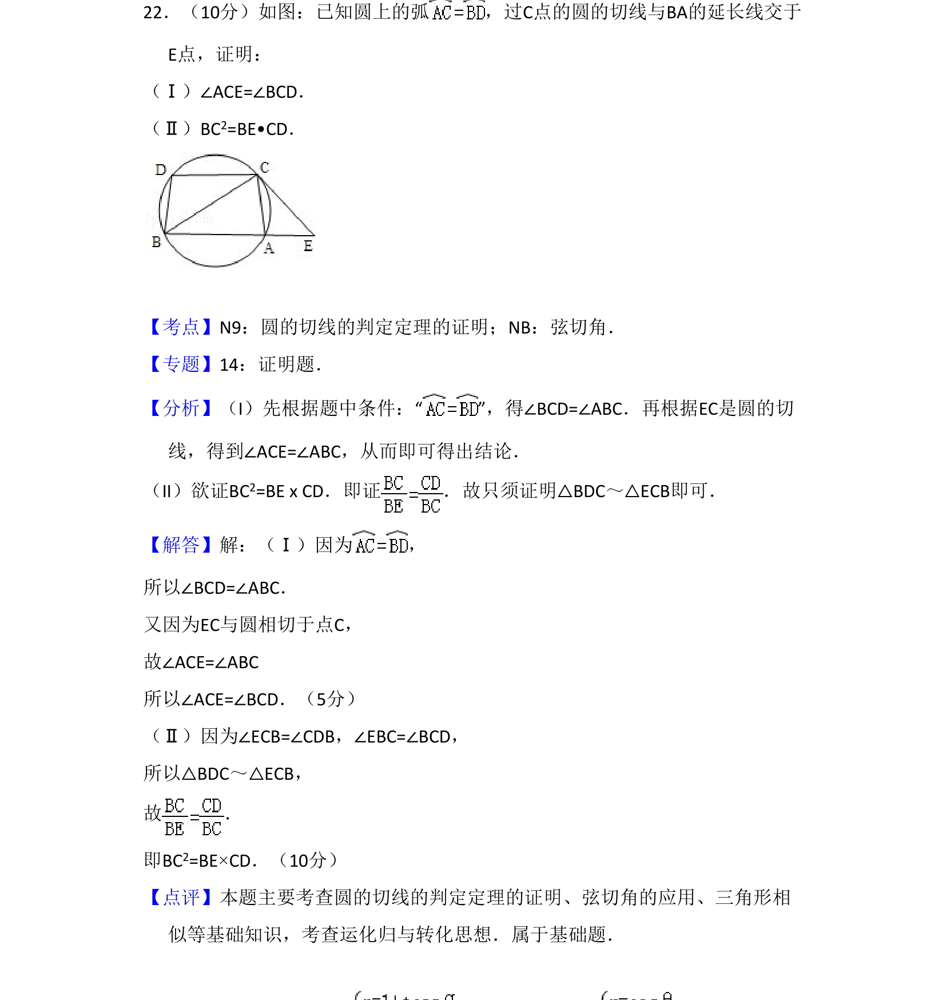
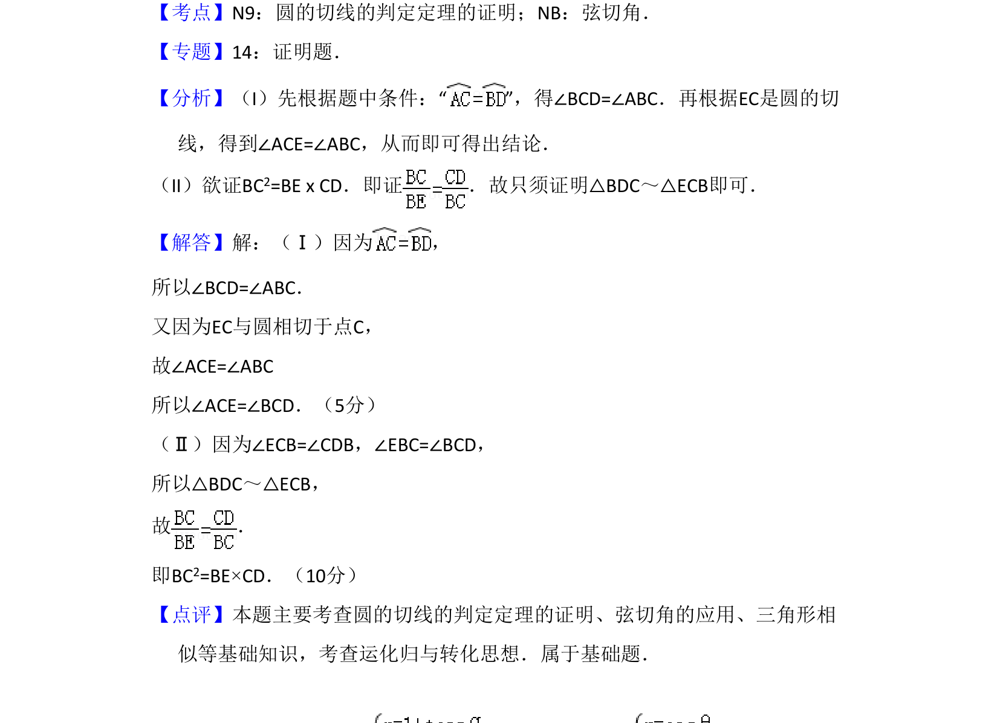

## 题面

## 摘要

本题利用圆的切线性质与弦切角定理证明角相等及线段比例关系，结合三角形相似进行推导。

## 关联考点

- [[1177-弦切角|弦切角]]
- [[221-圆周角定理|圆周角定理]]
- [[1033-相似三角形|相似三角形]]

## 答案与解析

> 📄 原 PDF 第 17 页：`素材/真题/吉林/2008-2024·（吉林）数学高考真题/2010年高考数学试卷（文）（新课标）（解析卷）.pdf`
