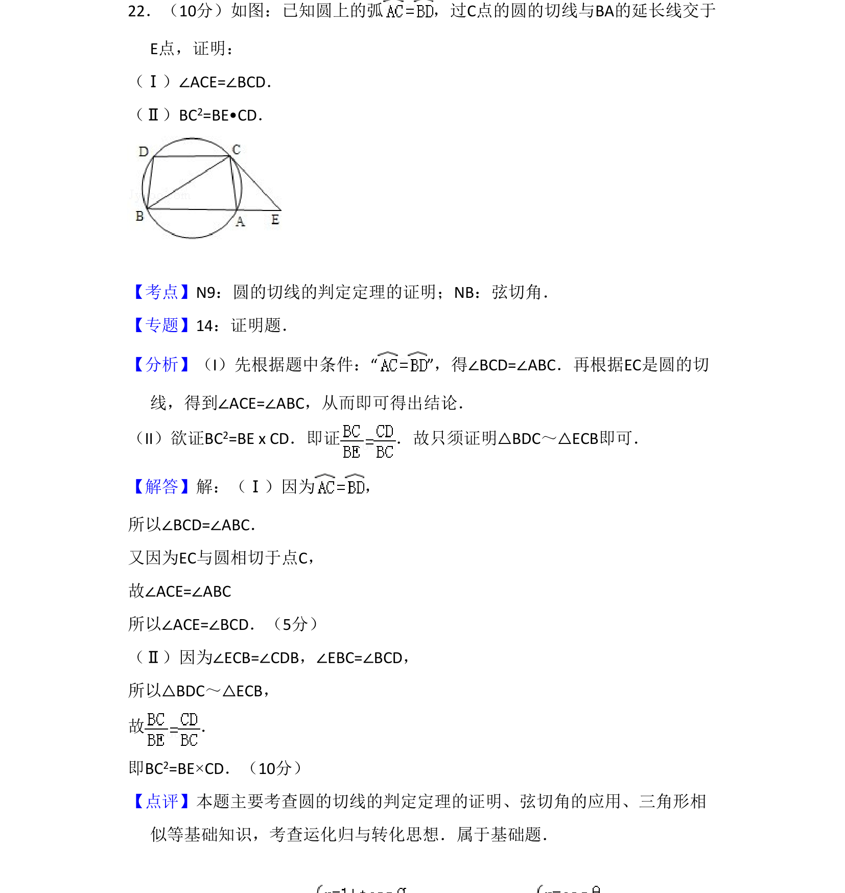
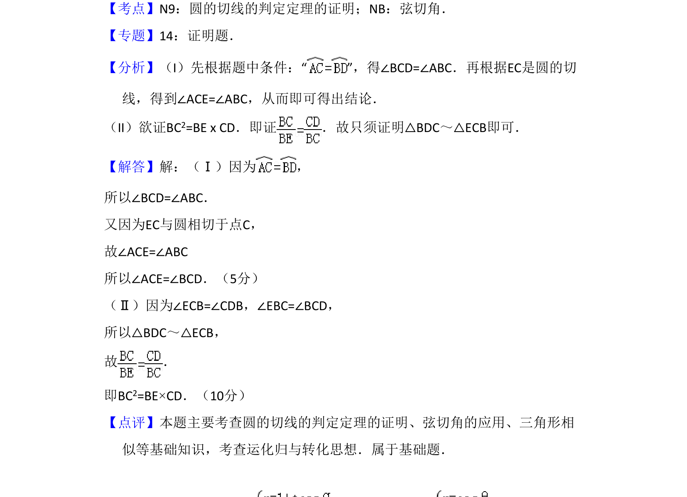

## 题面

## 摘要

本题利用圆的切线性质与弦切角定理证明角相等及线段比例关系，结合三角形相似进行推导。

## 关联考点

- [[1177-弦切角|弦切角]]
- [[221-圆周角定理|圆周角定理]]
- [[1033-相似三角形|相似三角形]]

## 答案与解析

> 📄 原 PDF 第 17 页：`素材/真题/吉林/2008-2024·（吉林）数学高考真题/2010年高考数学试卷（文）（新课标）（解析卷）.pdf`

<!-- 题干文本-start -->
## 题干文本
22．（10分）如图：已知圆上的弧 ，过C点的圆的切线与BA的延长线交于
E点，证明：
（Ⅰ）∠ACE=∠BCD．
（Ⅱ）BC2=BE•CD．
<!-- 题干文本-end -->

<!-- 解析文本-start -->
## 解析文本
【考点】N9：圆的切线的判定定理的证明；NB：弦切角．菁优网版权所有
【专题】14：证明题．
【分析】（I）先根据题中条件：“ ”，得∠BCD=∠ABC．再根据EC是圆的切
线，得到∠ACE=∠ABC，从而即可得出结论．
（II）欲证BC2=BE x CD．即证 ．故只须证明△BDC～△ECB即可．
【解答】解：（Ⅰ）因为 ，
所以∠BCD=∠ABC．
又因为EC与圆相切于点C，
故∠ACE=∠ABC
所以∠ACE=∠BCD．（5分）
（Ⅱ）因为∠ECB=∠CDB，∠EBC=∠BCD，
所以△BDC～△ECB，
故 ．
即BC2=BE×CD．（10分）
【点评】本题主要考查圆的切线的判定定理的证明、弦切角的应用、三角形相
似等基础知识，考查运化归与转化思想．属于基础题．
<!-- 解析文本-end -->
