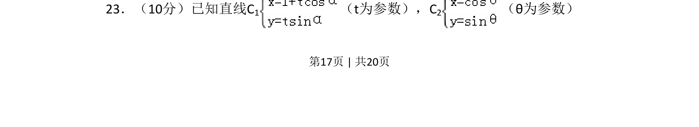
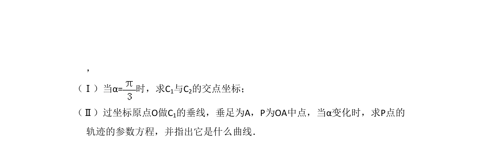
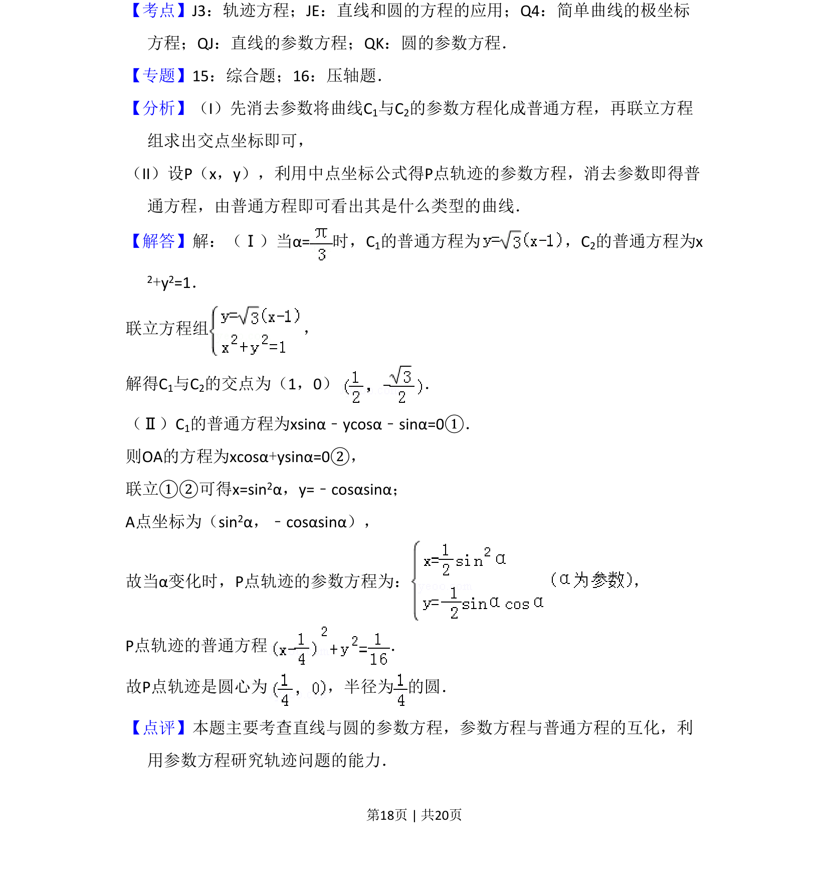

## 题面

## 摘要

本题要求对参数方程形式的直线与圆进行方程互化与几何关系分析。

## 关联考点

- [[061-方程|参数方程]]
- [[909-普通方程|普通方程]]
- [[1002-直线与圆|直线与圆]]

## 答案与解析

> 📄 原 PDF 第 17 页：`素材/真题/吉林/2008-2024·（吉林）数学高考真题/2010年高考数学试卷（文）（新课标）（解析卷）.pdf`
