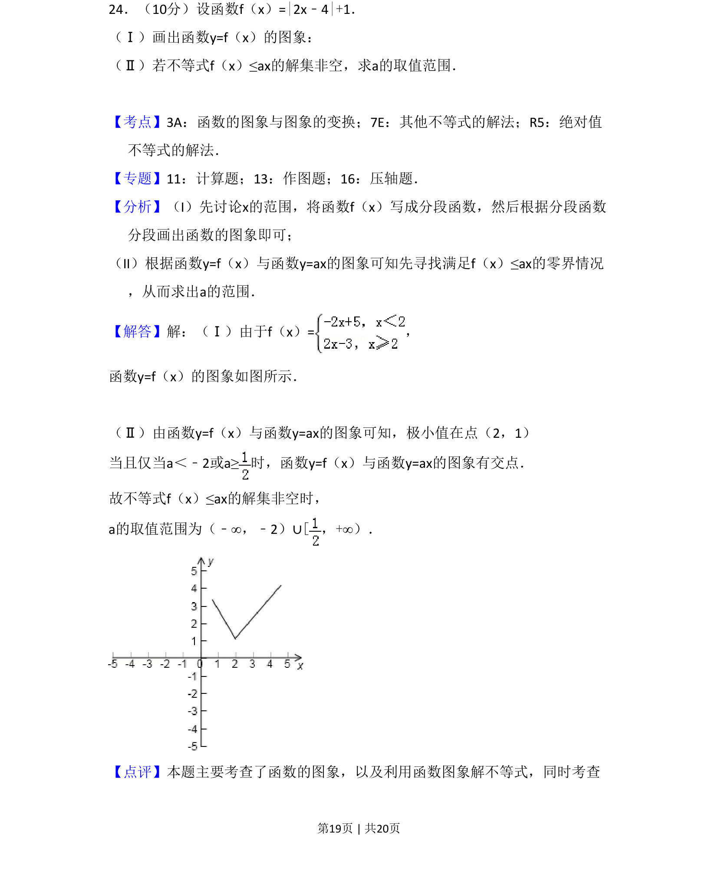
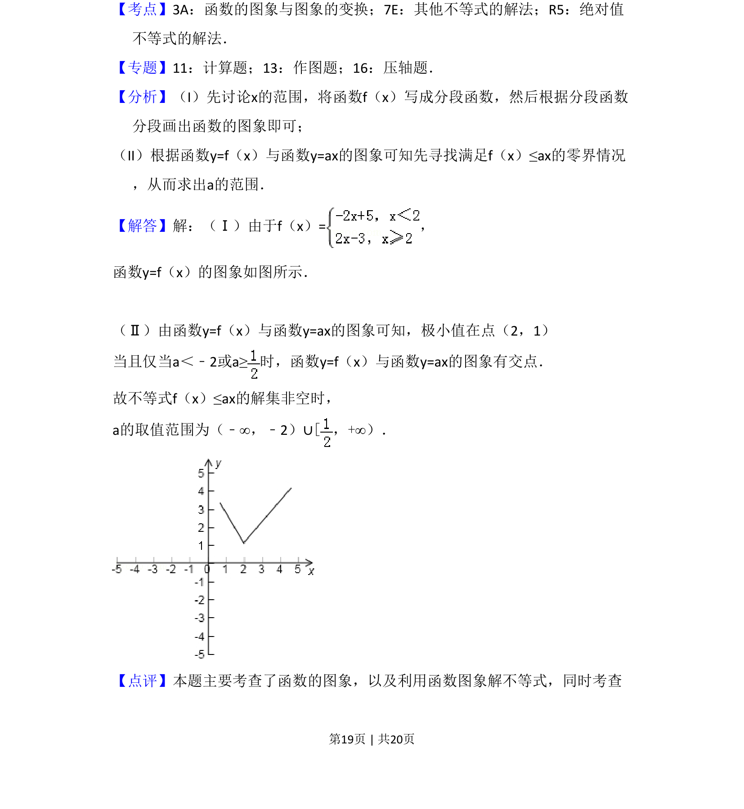
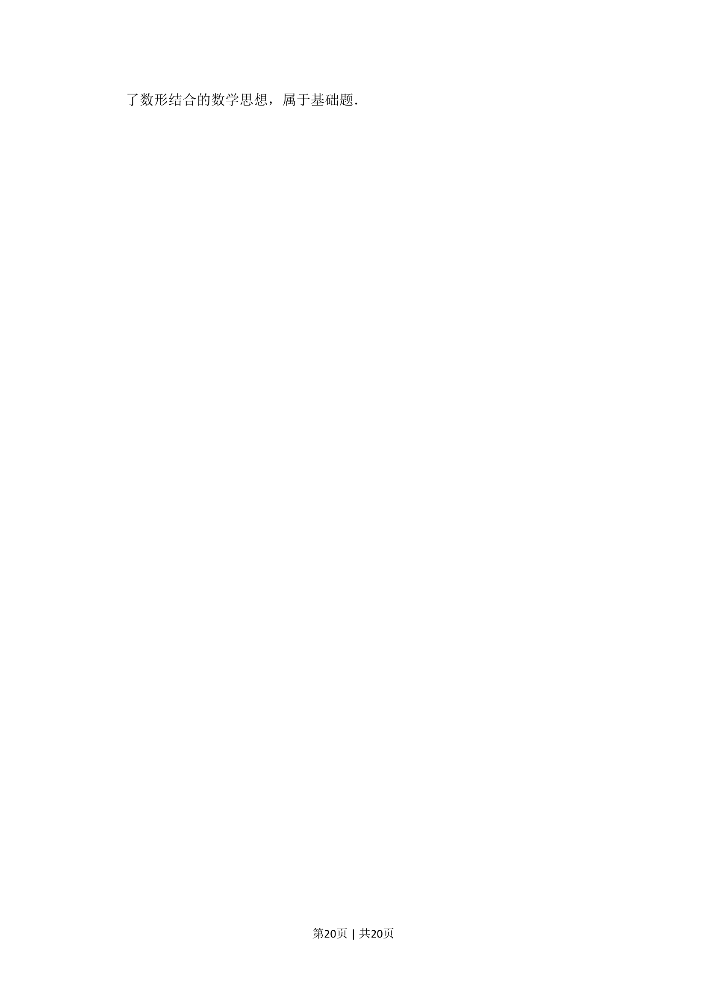

## 题面

## 摘要

考查绝对值函数图象画法及利用图象解含参不等式求参数范围。

## 关联考点

- [[689-函数的图象与图象的变换|函数的图象与图象的变换]]
- [[660-其他不等式的解法|其他不等式的解法]]
- [[1094-绝对值不等式的解法|绝对值不等式的解法]]

## 答案与解析

> 📄 原 PDF 第 19 页：`素材/真题/吉林/2008-2024·（吉林）数学高考真题/2010年高考数学试卷（文）（新课标）（解析卷）.pdf`
