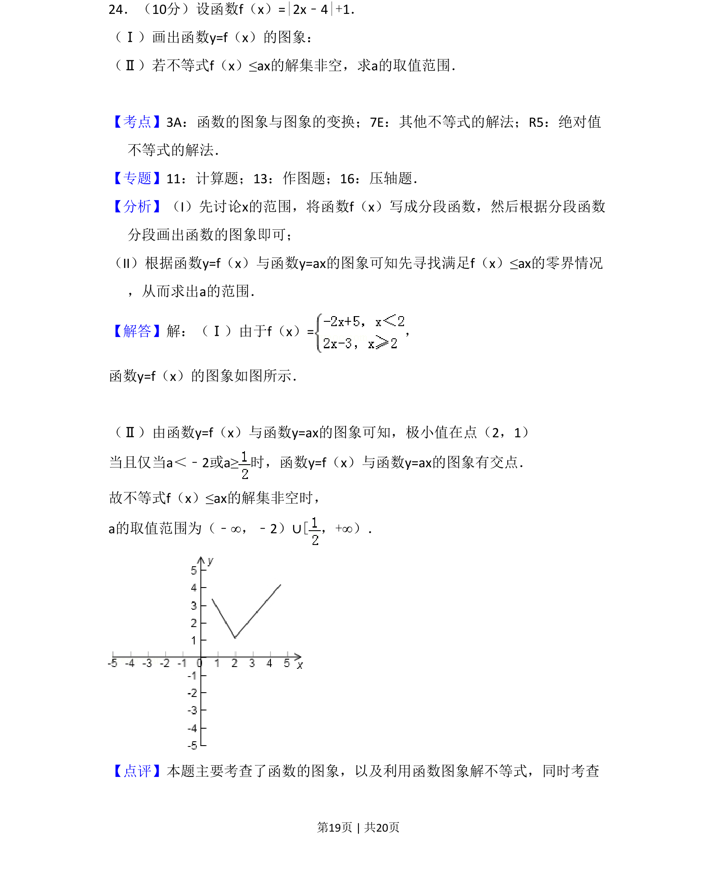
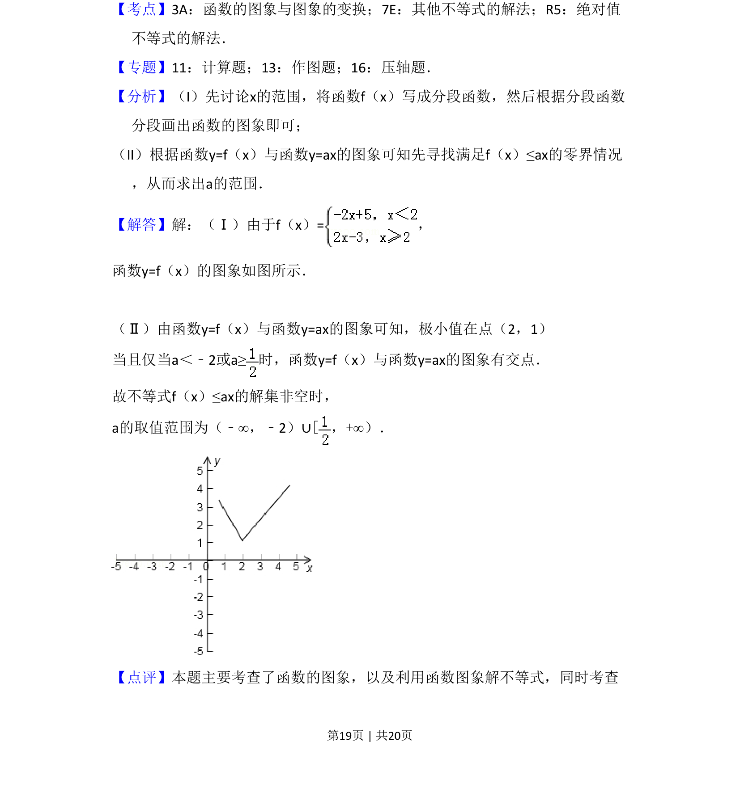

## 题面

## 摘要

考查绝对值函数图象画法及利用图象解含参不等式求参数范围。

## 关联考点

- [[689-函数的图象与图象的变换|函数的图象与图象的变换]]
- [[660-其他不等式的解法|其他不等式的解法]]
- [[1093-绝对值不等式的解法|绝对值不等式的解法]]

## 答案与解析

> 📄 原 PDF 第 19 页：`素材/真题/吉林/2008-2024·（吉林）数学高考真题/2010年高考数学试卷（文）（新课标）（解析卷）.pdf`

<!-- 题干文本-start -->
## 题干文本
24．（10分）设函数f（x）=|2x﹣4|+1．
（Ⅰ）画出函数y=f（x）的图象：
（Ⅱ）若不等式f（x）≤ax的解集非空，求a的取值范围．
<!-- 题干文本-end -->

<!-- 解析文本-start -->
## 解析文本
【考点】3A：函数的图象与图象的变换；7E：其他不等式的解法；R5：绝对值
不等式的解法．菁优网版权所有
【专题】11：计算题；13：作图题；16：压轴题．
【分析】（I）先讨论x的范围，将函数f（x）写成分段函数，然后根据分段函数
分段画出函数的图象即可；
（II）根据函数y=f（x）与函数y=ax的图象可知先寻找满足f（x）≤ax的零界情况
，从而求出a的范围．
【解答】解：（Ⅰ）由于f（x）=，
函数y=f（x）的图象如图所示．
（Ⅱ）由函数y=f（x）与函数y=ax的图象可知，极小值在点（2，1）
当且仅当a＜﹣2或a≥时，函数y=f（x）与函数y=ax的图象有交点．
故不等式f（x）≤ax的解集非空时，
a的取值范围为（﹣∞，﹣2）∪[，+∞）．
【点评】本题主要考查了函数的图象，以及利用函数图象解不等式，同时考查
<!-- 解析文本-end -->
