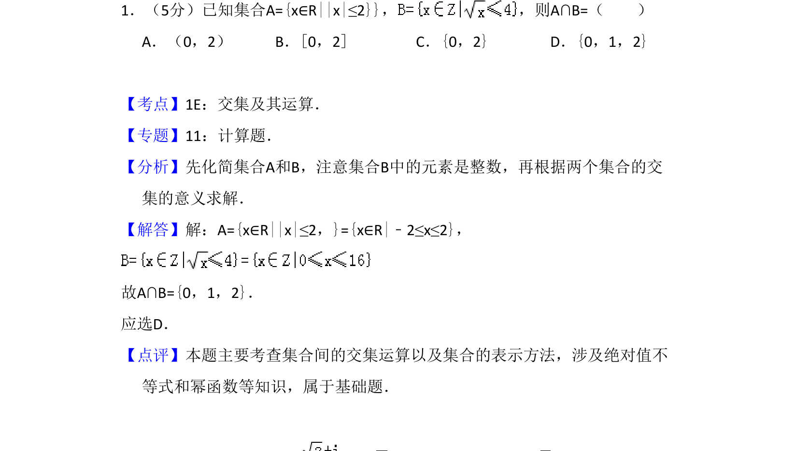
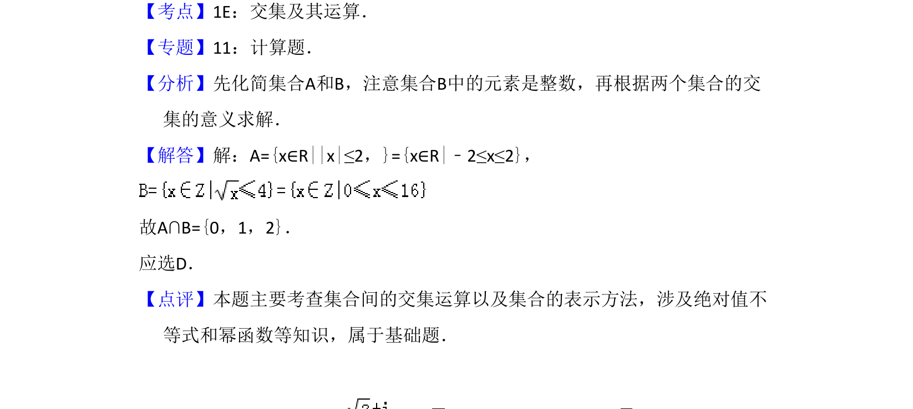

## 题面

## 摘要

考查集合交集运算，需解绝对值不等式并注意集合元素为整数。

## 关联考点

- [[042-集合|集合的交集运算]]
- [[1092-绝对值不等式|绝对值不等式]]
- [[1140-集合的表示法|集合表示法]]

## 答案与解析

> 📄 原 PDF 第 1 页：`素材/真题/吉林/2008-2024·（吉林）数学高考真题/2010年高考数学试卷（理）（新课标）（解析卷）.pdf`

<!-- 题干文本-start -->
## 题干文本
1．（5分）已知集合A={x∈R||x|≤2}}， ，则A∩B=（　　）
A．（0，2）B．[0，2]C．{0，2}D．{0，1，2}
<!-- 题干文本-end -->

<!-- 解析文本-start -->
## 解析文本
【考点】1E：交集及其运算．菁优网版权所有
【专题】11：计算题．
【分析】先化简集合A和B，注意集合B中的元素是整数，再根据两个集合的交
集的意义求解．
【解答】解：A={x∈R||x|≤2，}={x∈R|﹣2≤x≤2}，
故A∩B={0，1，2}．
应选D．
【点评】本题主要考查集合间的交集运算以及集合的表示方法，涉及绝对值不
等式和幂函数等知识，属于基础题．
<!-- 解析文本-end -->
