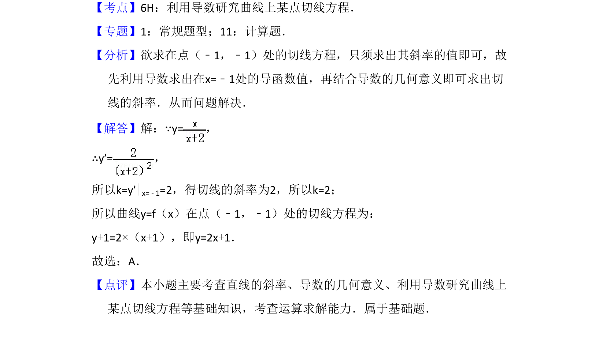

## 题面

## 摘要

求曲线在给定点的切线方程，考查导数几何意义和切线求法。

## 关联考点

- [[440-导数的几何意义|导数的几何意义]]
- [[422-切线方程|切线方程]]
- [[1216-斜率计算|斜率计算]]

## 答案与解析

> 📄 原 PDF 第 2 页：`素材/真题/吉林/2008-2024·（吉林）数学高考真题/2010年高考数学试卷（理）（新课标）（解析卷）.pdf`

<!-- 题干文本-start -->
## 题干文本
3．（5分）曲线y=在点（﹣1，﹣1）处的切线方程为（　　）
A．y=2x+1 B．y=2x﹣1 C．y=﹣2x﹣3 D．y=﹣2x﹣2
<!-- 题干文本-end -->

<!-- 解析文本-start -->
## 解析文本
【考点】6H：利用导数研究曲线上某点切线方程．菁优网版权所有
【专题】1：常规题型；11：计算题．
【分析】欲求在点（﹣1，﹣1）处的切线方程，只须求出其斜率的值即可，故
先利用导数求出在x=﹣1处的导函数值，再结合导数的几何意义即可求出切
线的斜率．从而问题解决．
【解答】解：∵y=，
∴y′=，
所以k=y′|x=﹣1=2，得切线的斜率为2，所以k=2；
所以曲线y=f（x）在点（﹣1，﹣1）处的切线方程为：
y+1=2×（x+1），即y=2x+1．
故选：A．
【点评】本小题主要考查直线的斜率、导数的几何意义、利用导数研究曲线上
某点切线方程等基础知识，考查运算求解能力．属于基础题．
<!-- 解析文本-end -->
