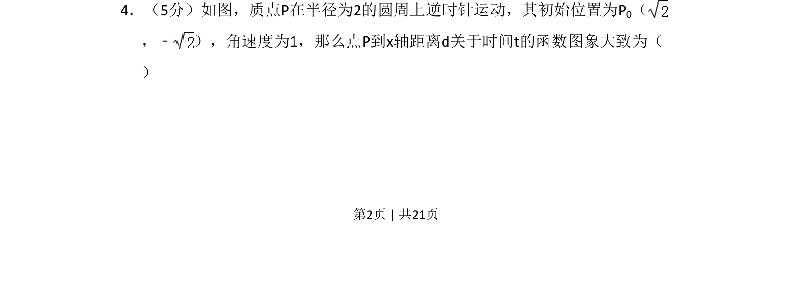

## 题面

## 摘要

本题通过质点圆周运动模型，考查根据运动参数建立距离关于时间的函数关系并识别其大致图像的能力。

## 关联考点

- [[三角函数模型]]
- [[061-方程|参数方程]]
- [[距离函数]]
- [[图像判断]]

## 答案与解析

> 📄 原 PDF 第 2 页：`素材/真题/吉林/2008-2024·（吉林）数学高考真题/2010年高考数学试卷（理）（新课标）（解析卷）.pdf`
