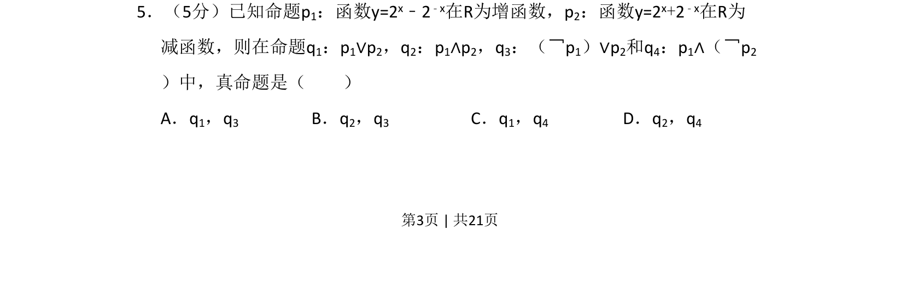
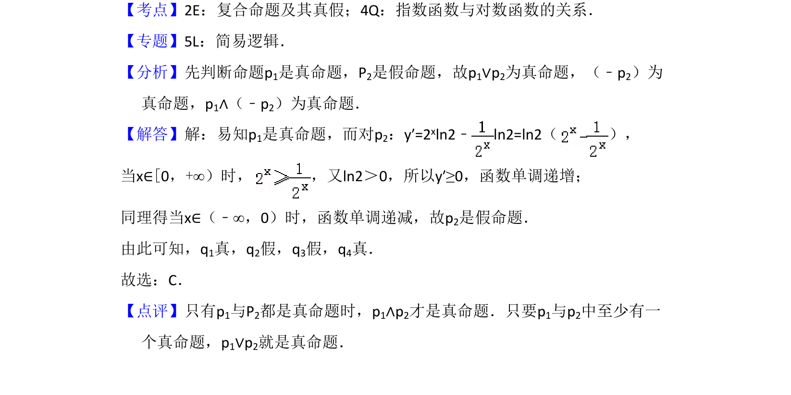

## 题面

## 摘要

本题通过判断两个指数型函数的单调性，考查复合命题的真假判定。

## 关联考点

- [[282-函数的单调性|函数的单调性]]
- [[798-复合命题的真假判断|复合命题的真假判断]]

## 答案与解析

> 📄 原 PDF 第 3 页：`素材/真题/吉林/2008-2024·（吉林）数学高考真题/2010年高考数学试卷（理）（新课标）（解析卷）.pdf`
