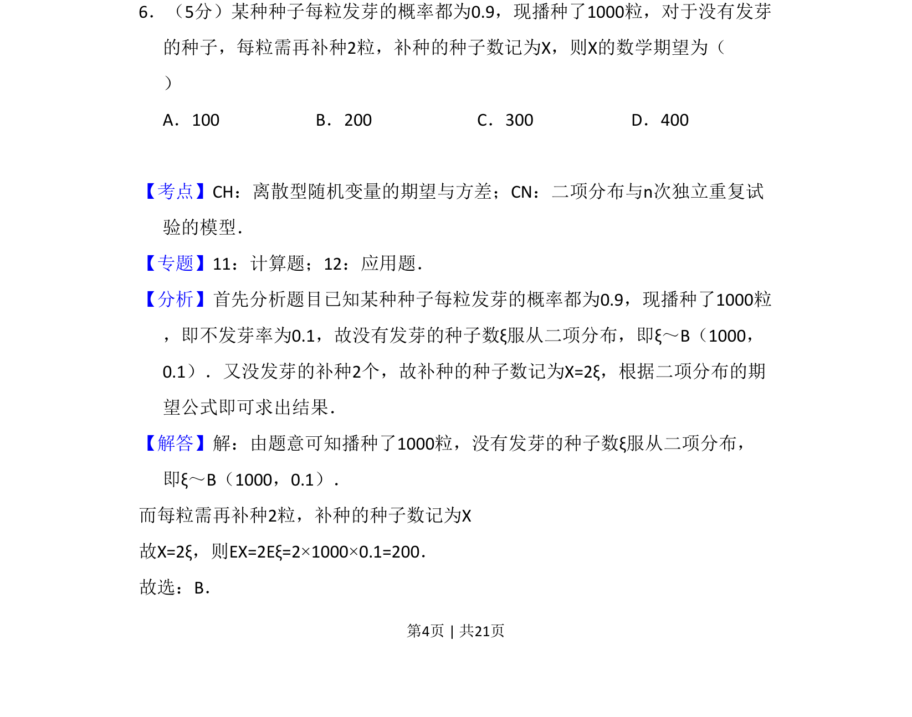

## 题面

## 摘要

该题考查二项分布期望的计算，通过补种数量与未发芽种子数的关系求期望。

## 关联考点

- [[469-二项分布|二项分布]]
- [[501-离散型随机变量期望|离散型随机变量期望]]
- [[501-离散型随机变量期望|数学期望]]

## 答案与解析

> 📄 原 PDF 第 4 页：`素材/真题/吉林/2008-2024·（吉林）数学高考真题/2010年高考数学试卷（理）（新课标）（解析卷）.pdf`
