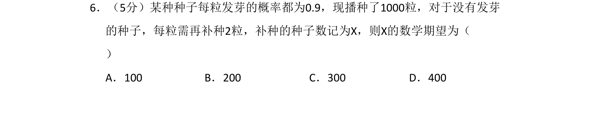
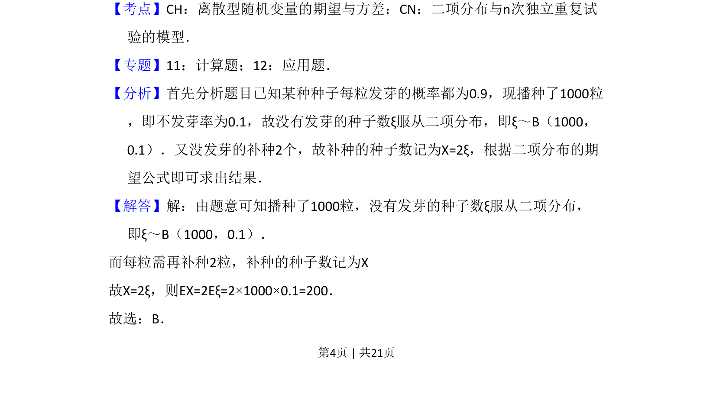

## 题面

## 摘要

该题考查二项分布期望的计算，通过补种数量与未发芽种子数的关系求期望。

## 关联考点

- [[469-二项分布|二项分布]]
- [[501-离散型随机变量期望|离散型随机变量期望]]
- [[501-离散型随机变量期望|数学期望]]

## 答案与解析

> 📄 原 PDF 第 4 页：`素材/真题/吉林/2008-2024·（吉林）数学高考真题/2010年高考数学试卷（理）（新课标）（解析卷）.pdf`

<!-- 题干文本-start -->
## 题干文本
6．（5分）某种种子每粒发芽的概率都为0.9，现播种了1000粒，对于没有发芽
的种子，每粒需再补种2粒，补种的种子数记为X，则X的数学期望为（　　
）
A．100 B．200 C．300 D．400
<!-- 题干文本-end -->

<!-- 解析文本-start -->
## 解析文本
【考点】CH：离散型随机变量的期望与方差；CN：二项分布与n次独立重复试
验的模型．菁优网版权所有
【专题】11：计算题；12：应用题．
【分析】首先分析题目已知某种种子每粒发芽的概率都为0.9，现播种了1000粒
，即不发芽率为0.1，故没有发芽的种子数ξ服从二项分布，即ξ～B（1000，
0.1）．又没发芽的补种2个，故补种的种子数记为X=2ξ，根据二项分布的期
望公式即可求出结果．
【解答】解：由题意可知播种了1000粒，没有发芽的种子数ξ服从二项分布，
即ξ～B（1000，0.1）．
而每粒需再补种2粒，补种的种子数记为X
故X=2ξ，则EX=2Eξ=2×1000×0.1=200．
故选：B．
<!-- 解析文本-end -->
