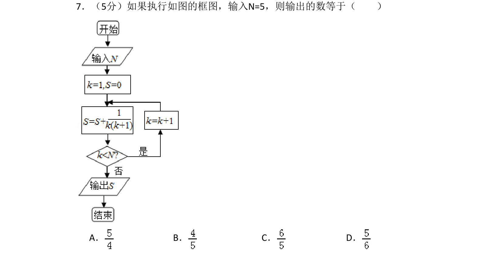
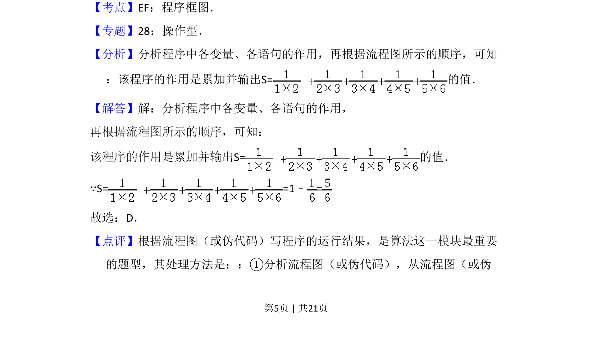
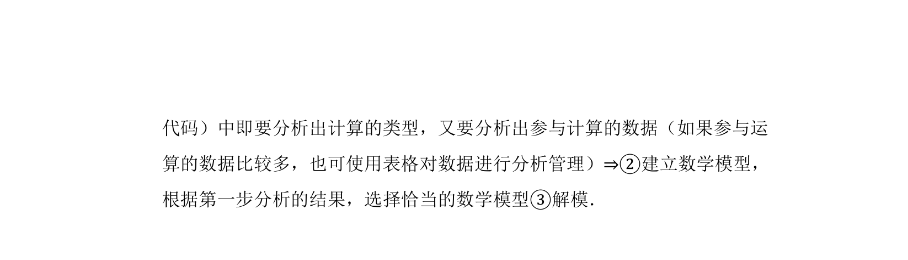

## 题面

## 摘要

该题考查程序框图的执行，输入 N=5，通过循环累加分数求和并输出结果。

## 关联考点

- [[1042-程序框图|程序框图]]
- [[870-循环结构|循环结构]]
- [[1081-累加求和|累加求和]]

## 答案与解析

> 📄 原 PDF 第 5 页：`素材/真题/吉林/2008-2024·（吉林）数学高考真题/2010年高考数学试卷（理）（新课标）（解析卷）.pdf`

<!-- 题干文本-start -->
## 题干文本
7．（5分）如果执行如图的框图，输入N=5，则输出的数等于（　　）
A．B．C．D．
<!-- 题干文本-end -->

<!-- 解析文本-start -->
## 解析文本
【考点】EF：程序框图．菁优网版权所有
【专题】28：操作型．
【分析】分析程序中各变量、各语句的作用，再根据流程图所示的顺序，可知
：该程序的作用是累加并输出S=的值．
【解答】解：分析程序中各变量、各语句的作用，
再根据流程图所示的顺序，可知：
该程序的作用是累加并输出S=的值．
∵S= =1﹣=
故选：D．
【点评】根据流程图（或伪代码）写程序的运行结果，是算法这一模块最重要
的题型，其处理方法是：：①分析流程图（或伪代码），从流程图（或伪
<!-- 解析文本-end -->
