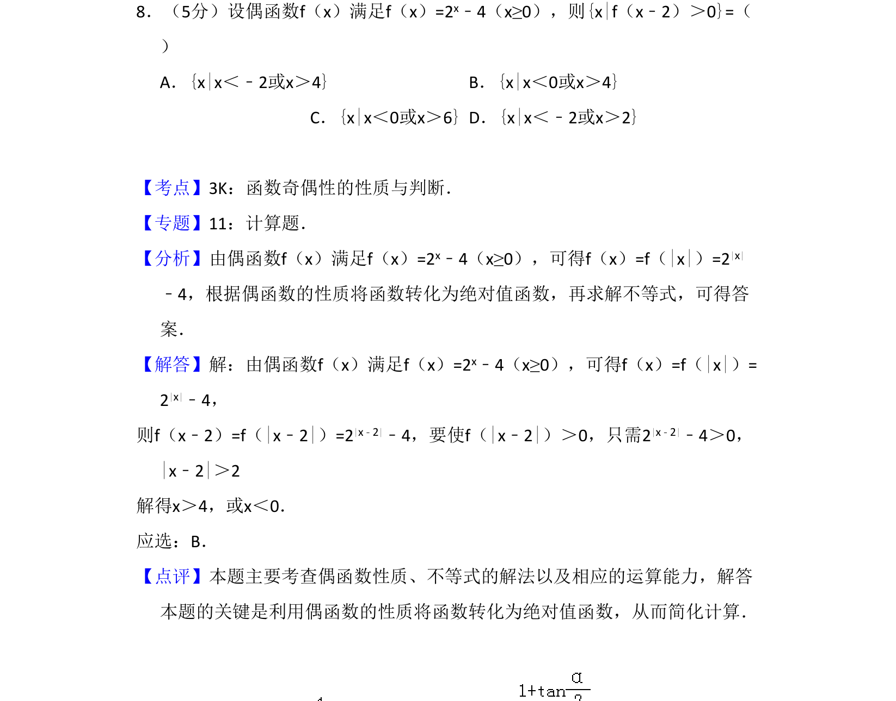
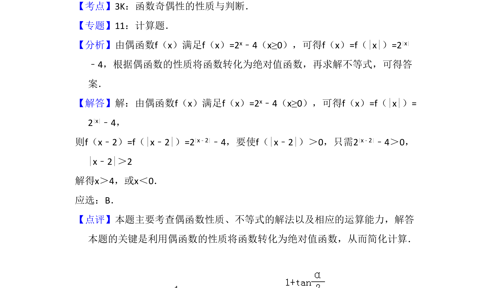

## 题面

## 摘要

本题利用偶函数性质将分段函数转化为绝对值函数，并求解绝对值不等式。

## 关联考点

- [[679-函数奇偶性|函数奇偶性]]
- [[585-绝对值函数|绝对值函数]]
- [[1108-解不等式|解不等式]]

## 答案与解析

> 📄 原 PDF 第 6 页：`素材/真题/吉林/2008-2024·（吉林）数学高考真题/2010年高考数学试卷（理）（新课标）（解析卷）.pdf`
