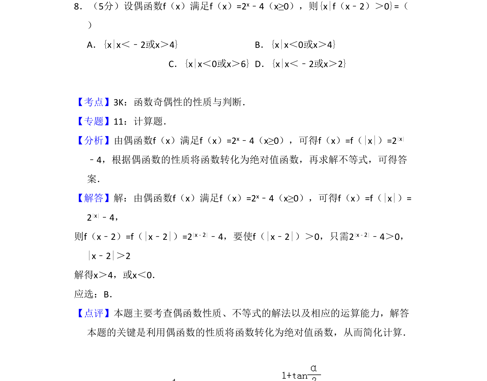
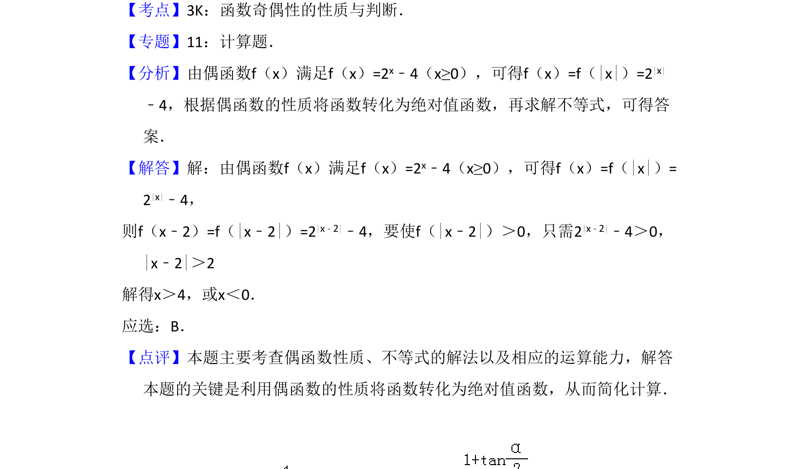

## 题面

## 摘要

本题利用偶函数性质将分段函数转化为绝对值函数，并求解绝对值不等式。

## 关联考点

- [[284-函数的奇偶性|函数奇偶性]]
- [[585-绝对值函数|绝对值函数]]
- [[1108-解不等式|解不等式]]

## 答案与解析

> 📄 原 PDF 第 6 页：`素材/真题/吉林/2008-2024·（吉林）数学高考真题/2010年高考数学试卷（理）（新课标）（解析卷）.pdf`

<!-- 题干文本-start -->
## 题干文本
8．（5分）设偶函数f（x）满足f（x）=2x﹣4（x≥0），则{x|f（x﹣2）＞0}=（　　
）
A．{x|x＜﹣2或x＞4}B．{x|x＜0或x＞4}
C．{x|x＜0或x＞6}D．{x|x＜﹣2或x＞2}
<!-- 题干文本-end -->

<!-- 解析文本-start -->
## 解析文本
【考点】3K：函数奇偶性的性质与判断．菁优网版权所有
【专题】11：计算题．
【分析】由偶函数f（x）满足f（x）=2x﹣4（x≥0），可得f（x）=f（|x|）=2|x|
﹣4，根据偶函数的性质将函数转化为绝对值函数，再求解不等式，可得答
案．
【解答】解：由偶函数f（x）满足f（x）=2x﹣4（x≥0），可得f（x）=f（|x|）=
2|x|﹣4，
则f（x﹣2）=f（|x﹣2|）=2|x﹣2|﹣4，要使f（|x﹣2|）＞0，只需2|x﹣2|﹣4＞0，
|x﹣2|＞2
解得x＞4，或x＜0．
应选：B．
【点评】本题主要考查偶函数性质、不等式的解法以及相应的运算能力，解答
本题的关键是利用偶函数的性质将函数转化为绝对值函数，从而简化计算．
<!-- 解析文本-end -->
