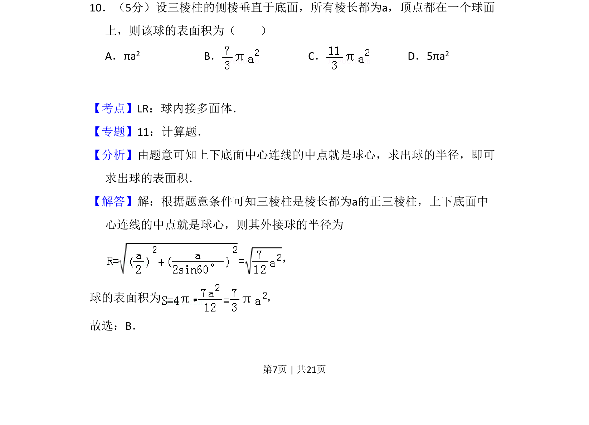
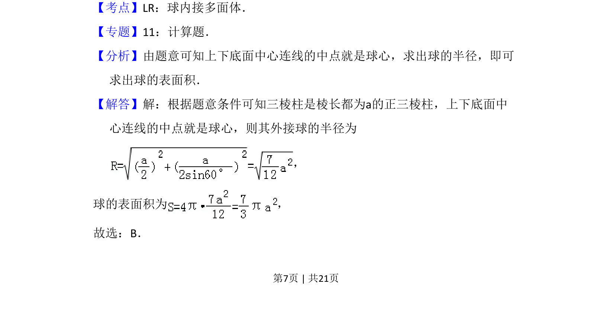
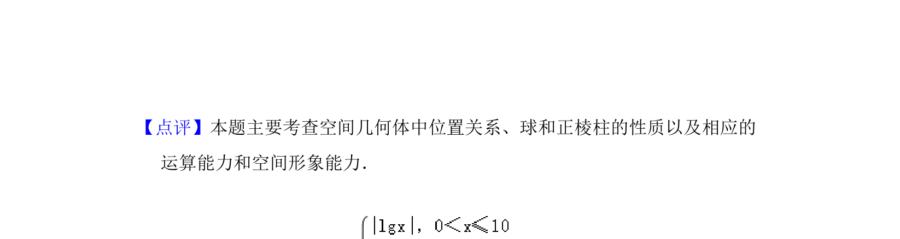

## 题面

## 摘要

正三棱柱外接球的表面积计算，通过上下底面中心连线中点确定球心求半径。

## 关联考点

- [[989-球内接多面体|球内接多面体]]
- [[994-球的表面积|球的表面积]]
- [[955-正三棱柱|正三棱柱]]
- [[814-外接球半径|外接球半径]]

## 答案与解析

> 📄 原 PDF 第 7 页：`素材/真题/吉林/2008-2024·（吉林）数学高考真题/2010年高考数学试卷（理）（新课标）（解析卷）.pdf`
