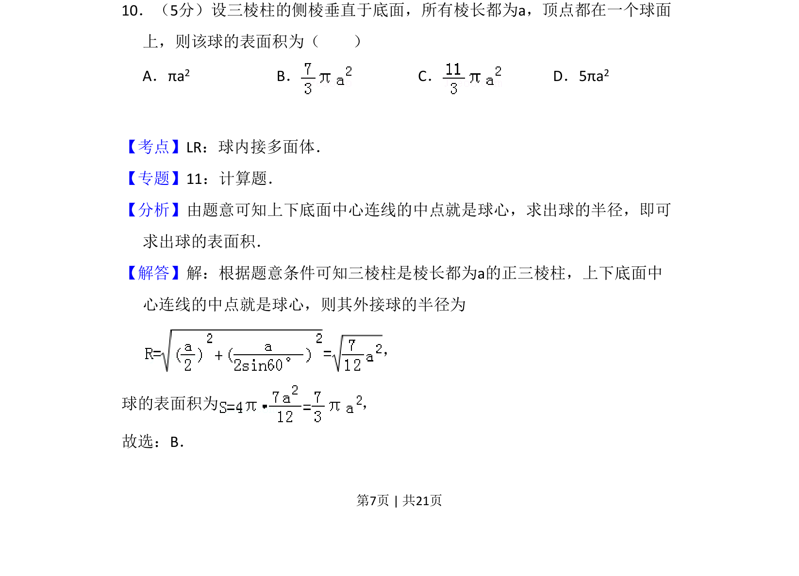
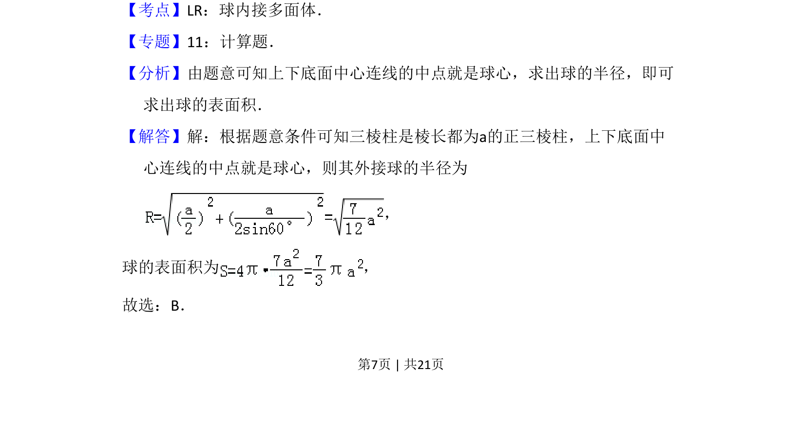
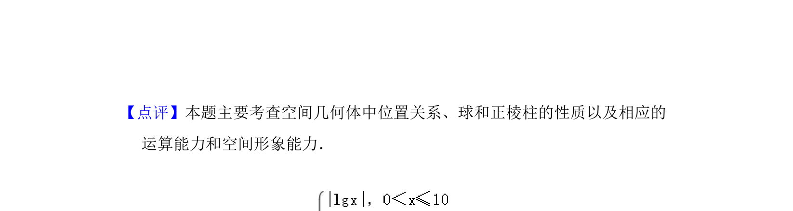

## 题面

## 摘要

正三棱柱外接球的表面积计算，通过上下底面中心连线中点确定球心求半径。

## 关联考点

- [[988-球内接多面体|球内接多面体]]
- [[993-球的表面积|球的表面积]]
- [[954-正三棱柱|正三棱柱]]
- [[813-外接球半径|外接球半径]]

## 答案与解析

> 📄 原 PDF 第 7 页：`素材/真题/吉林/2008-2024·（吉林）数学高考真题/2010年高考数学试卷（理）（新课标）（解析卷）.pdf`

<!-- 题干文本-start -->
## 题干文本
10．（5分）设三棱柱的侧棱垂直于底面，所有棱长都为a，顶点都在一个球面
上，则该球的表面积为（　　）
A．πa2 B．C．D．5πa 2
<!-- 题干文本-end -->

<!-- 解析文本-start -->
## 解析文本
【考点】LR：球内接多面体．菁优网版权所有
【专题】11：计算题．
【分析】由题意可知上下底面中心连线的中点就是球心，求出球的半径，即可
求出球的表面积．
【解答】解：根据题意条件可知三棱柱是棱长都为a的正三棱柱，上下底面中
心连线的中点就是球心，则其外接球的半径为
，
球的表面积为 ，
故选：B．
<!-- 解析文本-end -->
