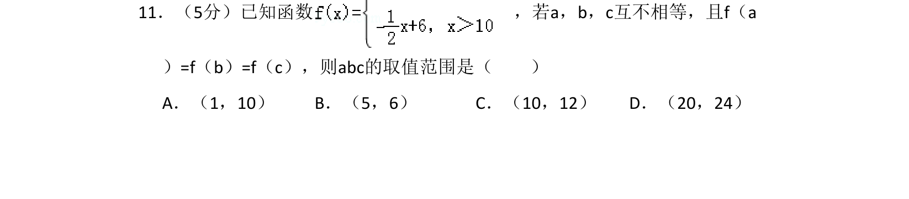
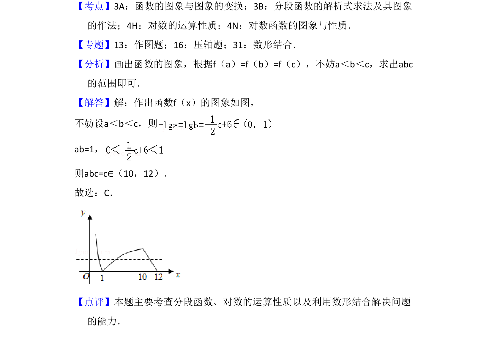

## 题面

## 摘要

本题通过分段函数图象，结合对数运算性质，利用数形结合求函数值相等时自变量的取值范围。

## 关联考点

- [[290-分段函数|分段函数]]
- [[301-对数运算性质|对数运算性质]]
- [[数形结合]]
- [[函数图象变换]]

## 答案与解析

> 📄 原 PDF 第 8 页：`素材/真题/吉林/2008-2024·（吉林）数学高考真题/2010年高考数学试卷（理）（新课标）（解析卷）.pdf`
