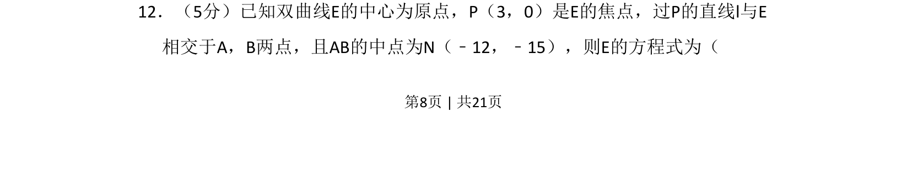
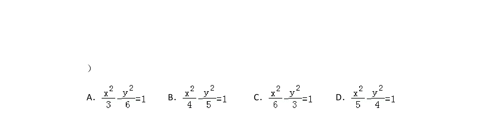
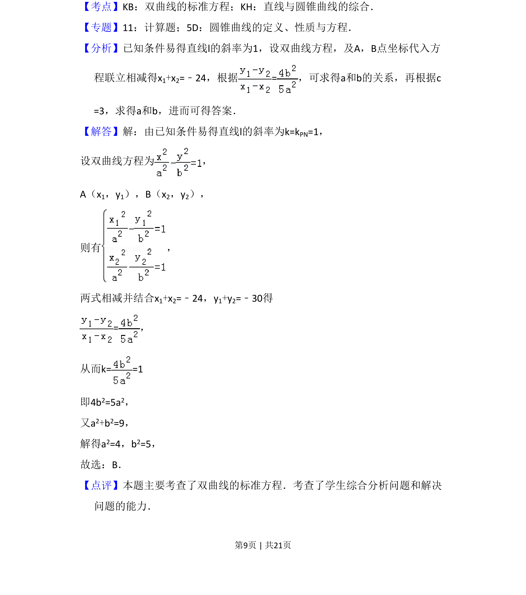

## 题面

## 摘要

已知焦点及中点弦条件求双曲线方程

## 关联考点

- [[538-双曲线标准方程|双曲线标准方程]]
- [[1213-中点弦|中点弦]]
- [[037-焦点焦距|焦点]]
- [[1001-直线与双曲线位置关系|直线与双曲线位置关系]]

## 答案与解析

> 📄 原 PDF 第 8 页：`素材/真题/吉林/2008-2024·（吉林）数学高考真题/2010年高考数学试卷（理）（新课标）（解析卷）.pdf`
