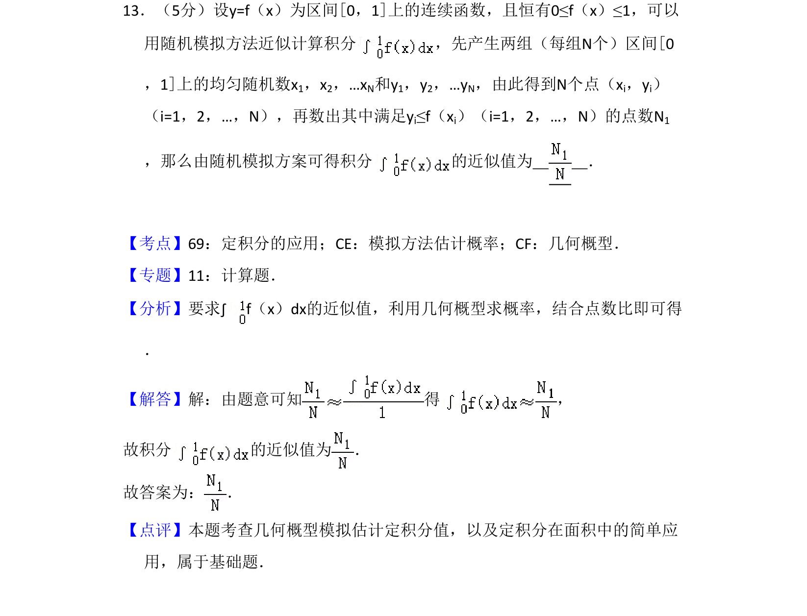
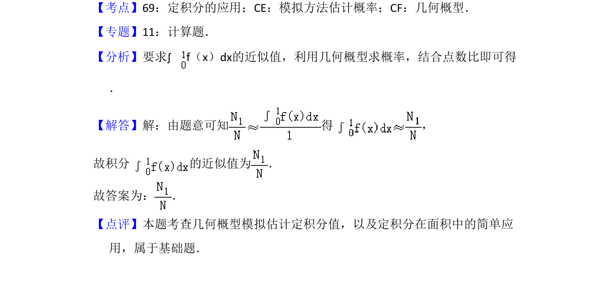

## 题面

## 摘要

本题通过随机模拟方法和几何概型近似计算定积分的值。

## 关联考点

- [[824-定积分的应用|定积分的应用]]
- [[1190-模拟方法估计概率|模拟方法估计概率]]
- [[667-几何概型|几何概型]]

## 答案与解析

> 📄 原 PDF 第 10 页：`素材/真题/吉林/2008-2024·（吉林）数学高考真题/2010年高考数学试卷（理）（新课标）（解析卷）.pdf`
