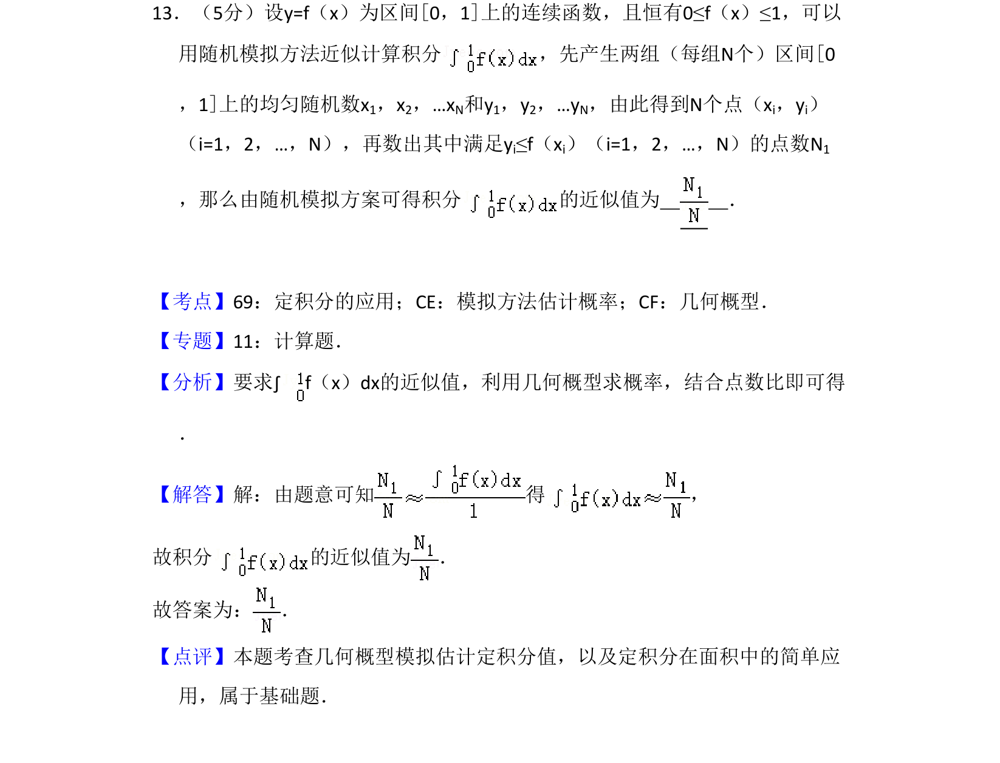
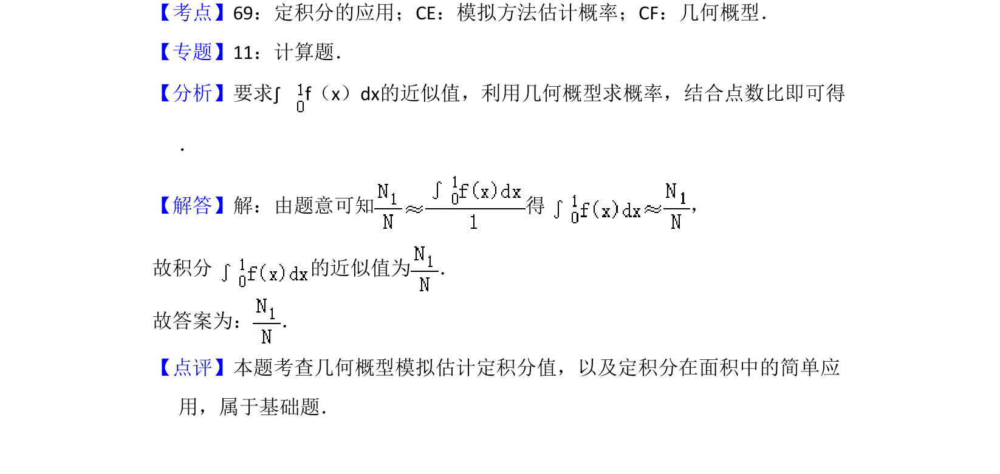

## 题面

## 摘要

本题通过随机模拟方法和几何概型近似计算定积分的值。

## 关联考点

- [[1190-定积分应用|定积分的应用]]
- [[1189-模拟方法估计概率|模拟方法估计概率]]
- [[667-几何概型|几何概型]]

## 答案与解析

> 📄 原 PDF 第 10 页：`素材/真题/吉林/2008-2024·（吉林）数学高考真题/2010年高考数学试卷（理）（新课标）（解析卷）.pdf`

<!-- 题干文本-start -->
## 题干文本
13．（5分）设y=f（x）为区间[0，1]上的连续函数，且恒有0≤f（x）≤1，可以
用随机模拟方法近似计算积分 ，先产生两组（每组N个）区间[0
，1]上的均匀随机数x1，x2，…xN和y1，y2，…yN，由此得到N个点（xi，yi）
（i=1，2，…，N），再数出其中满足yi≤f（xi）（i=1，2，…，N）的点数N1
，那么由随机模拟方案可得积分 的近似值为　 　．
<!-- 题干文本-end -->

<!-- 解析文本-start -->
## 解析文本
【考点】69：定积分的应用；CE：模拟方法估计概率；CF：几何概型．菁优网版权所有
【专题】11：计算题．
【分析】要求∫f（x）dx的近似值，利用几何概型求概率，结合点数比即可得
．
【解答】解：由题意可知 得 ，
故积分 的近似值为 ．
故答案为： ．
【点评】本题考查几何概型模拟估计定积分值，以及定积分在面积中的简单应
用，属于基础题．
<!-- 解析文本-end -->
