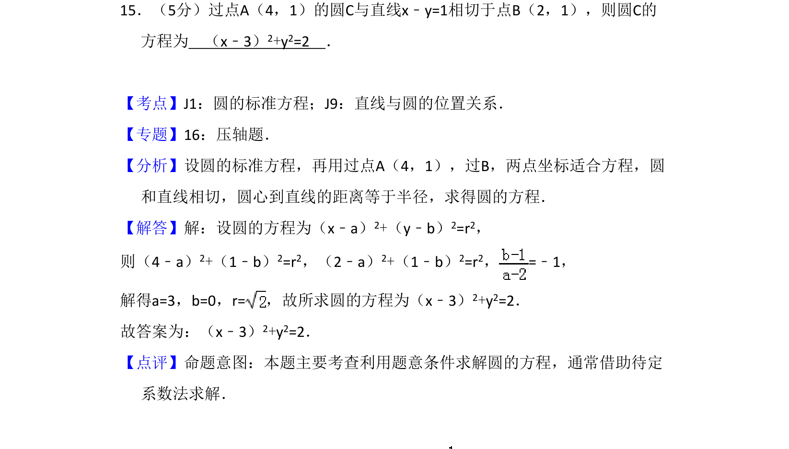

## 题面

## 摘要

根据点与坐标、相切条件，利用待定系数法求解圆的标准方程。

## 关联考点

- [[373-圆的标准方程|圆的标准方程]]
- [[394-直线和圆位置关系-高中|直线与圆的位置关系]]
- [[392-点到直线距离公式|点到直线距离公式]]

## 答案与解析

> 📄 原 PDF 第 11 页：`素材/真题/吉林/2008-2024·（吉林）数学高考真题/2010年高考数学试卷（理）（新课标）（解析卷）.pdf`
